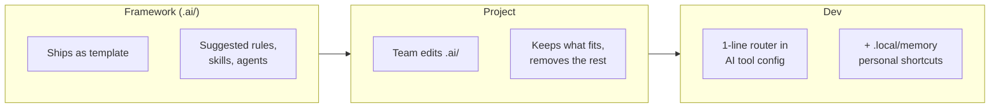

# .ai — AI Coding Framework

**Every teammate gets the same high-quality AI behavior — regardless of which AI tool they use.**

---

## Why

| Without DevFlow | With DevFlow |
|-----------------|--------------|
| Each dev writes their own AI instructions from scratch | One framework, shared across the team |
| Cursor user gets different rules than Zed user | Same safety, quality, and workflow rules for everyone |
| Onboarding = "figure out your AI settings" | Onboarding = copy `.local/` templates, done |
| Reviews catch inconsistent AI output | Rules enforce consistency before code is written |
| Token waste from duplicated rules | Tiered loading — only what's needed, when needed |

---

## How It Works



1. **Framework ships** — `.ai/` is a starter template with rules, skills, and agents.
2. **Project customizes** — team edits `.ai/` files: keeps what fits, removes or changes the rest.
3. **Dev layers personal** — each dev adds a 1-line router to their AI tool, plus `.local/memory.md` for shortcuts.

---

## Works With Your AI Tool

Zed, Cursor, Copilot, Claude Code, Gemini CLI, Windsurf, Codeium, Aider, JetBrains AI — and any other that reads markdown.

Paste this line into your tool's config:

```
Read `.ai/startup.md` first — it loads all rules, memory, and corrections for this session.
```

| LLM | File to update | Project location |
|-----|---------------|-----------------|
| Codex | `AGENTS.md` | `<repo>/AGENTS.md` |
| Zed | `.rules` | `<repo>/.rules` |
| Cursor | `.cursorrules` / `.cursor/rules/main.mdc` | `<repo>/.cursor/rules/main.mdc` |
| Copilot | `copilot-instructions.md` | `<repo>/.github/copilot-instructions.md` |
| Claude Code | `CLAUDE.md` | `<repo>/CLAUDE.md` |
| Gemini CLI | `GEMINI.md` | `<repo>/GEMINI.md` |
| Windsurf | `.windsurfrules` | `<repo>/.windsurfrules` |
| Codeium | `CODEIUM.md` | `<repo>/CODEIUM.md` |
| Aider | `CONVENTIONS.md` | `<repo>/CONVENTIONS.md` |
| JetBrains | `.aia/instructions.md` | `<repo>/.ijwb/.aia/instructions.md` |

---

## Deploy in 1 Step

```bash
cp -r .ai/ target-repo/
```

Then the team customizes:

| Step | Who | Action |
|------|-----|--------|
| 1 | Lead | Edit `.ai/` — keep what fits the project, remove or change the rest |
| 2 | Each dev | Paste the 1-line router into their AI tool's config (see table above) |
| 3 | Each dev | Copy templates: `memory.md.template` → `.local/memory.md`, `session-rules.md.template` → `.local/session-rules.md` |

---

## What's Inside

| Folder | Contents |
|--------|----------|
| `.ai/rules/` | `core.md` (safety, anti-hallucination, hard stops), `coding.md` (code quality), `pr.md` (PR reviews), templates |
| `.ai/skills/` | Reusable skills — md-to-html, review-md, grill-me, handoff, change-report, and more |
| `.ai/agents/` | Agent definitions — DevFlow (full pipeline), RefFlow (refactoring) |
| `.ai/plugins/` | Plugin bundles — DevFlow, RefFlow, JiraFlow, GithubFlow |
| `.ai/startup.md` | Session startup checklist — loads rules, memory, corrections |

---

## Rules Loaded — Only When Needed

| When | What loads | Cost |
|------|-----------|------|
| Always | 1-line router (per-dev) | ~1 line |
| Session start | `core.md` (framework rules) | ~5 KB, ~140 lines |
| First code task | `coding.md` (code quality) | ~6 KB, ~260 lines |
| On skill invocation | Skill instructions | Pay-per-use |
| Startup | Personal memory, corrections | User-defined |

Nothing duplicated. Nothing loaded until needed.

---

## Adding a New AI Tool

Add a row to the table above. Done — no other files change.
