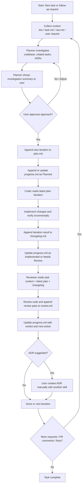

# Agent Workflow README

This workflow uses three agents — planner, coder, and reviewer — stored in `.ai/agents`, plus a small set of tracked templates, to manage software tasks in an append-only, iteration-based way. Local task artifacts live under `.local/tasks`, which keeps developer working state separate from tracked agent definitions.

## Goals

- Keep tracked agent definitions and templates in `.ai/agents`.
- Keep one local working folder per task in `.local/tasks/[KEY]`.
- Add `.local/tasks` to `.gitignore` so local task artifacts are not committed.
- Keep task history in the same files by appending iterations instead of replacing old content.
- Support iteration 1 from Jira, then later iterations from PR comments, review findings, bug reports, or manual user instructions.
- Keep planning context rich enough for implementation, but compact enough for repeated LLM reading.
- Separate ADR recommendation from ADR creation; the reviewer can suggest an ADR, but a different skill or a human creates it manually.

## Directory layout

```text
.ai/
└── agents/
  ├── dev-planner.md
  ├── dev-coder.md
  ├── dev-reviewer.md
  └── templates/
     ├── plan-template.md
     ├── changelog-template.md
     ├── review-template.md
     └── progress-template.md

.local/
└── tasks/
  └── [KEY]/
     ├── task.md
     ├── raw.md
     ├── plan.md
     ├── changelog.md
     ├── review.md
     └── progress.md
```

```gitignore
.local/tasks/
```

- `task.md` stores normalized task requirements when available.
- `raw.md` stores Jira description, comments, and raw context when available.
- `plan.md`, `changelog.md`, and `review.md` are append-only files that accumulate iterations and review passes over time.
- `progress.md` is the compact timeline used to quickly understand current state and next action.

## Core idea

The workflow keeps tracked agent logic and templates under `.ai/agents`, while stable task-level context and append-only working artifacts live under `.local/tasks/[KEY]`. Each artifact keeps stable context at the top and appends iteration-specific sections below it, which reduces repetition while preserving enough structure for agents to read the latest work, understand earlier decisions, and continue from the correct state.

## Roles

### Planner

- Reads task context from the best available source: local task files first when present, otherwise Jira via MCP, otherwise the user message.
- Investigates the repository, related tasks, and relevant ADRs before planning.
- Shows an investigation summary to the user before writing a new plan iteration.
- Appends a new iteration to `plan.md` and a matching timeline entry to `progress.md` after approval.
- Keeps `Confidence` in each proposed change and moves related-task impact scoring into the planner's user-facing summary instead of `plan.md` itself.

### Coder

- Reads the full `plan.md` but treats the latest iteration as the active implementation source of truth.
- Implements the planned changes in order, verifies work incrementally, and reports progress to the user after major items.
- Appends the iteration result to `changelog.md` and updates the same iteration in `progress.md`.
- Stops and asks for clarification or re-planning when assumptions fail or scope changes materially.

### Reviewer

- Reviews the actual code against task context, the active plan iteration, repository standards, and the matching changelog iteration.
- Appends a new review pass to `review.md` and updates the task state in `progress.md`.
- Records verdicts as `Pass`, `Pass with Changes`, or `Fail` in the review artifact, and maps these to practical next actions for the team.
- Suggests whether an ADR would be appropriate, but does not create ADR files.

## File responsibilities

| File | Purpose | Updated by |
|---|---|---|
| `task.md` | Stable task requirements and normalized context when available. | Human or upstream sync. |
| `raw.md` | Raw Jira/task comments and captured source material. | Human or upstream sync. |
| `plan.md` | Append-only implementation plans by iteration. | Planner. |
| `changelog.md` | Append-only record of what was actually implemented per iteration. | Coder. |
| `review.md` | Append-only review passes and findings. | Reviewer. |
| `progress.md` | Compact timeline of each iteration and current task state. | Planner, coder, reviewer. |

## Iteration model

- Iteration 1 usually starts from the Jira task or the best available task source.
- Later iterations may be triggered by PR comments, review feedback, test failures, production bugs, or direct user instructions.
- Each iteration uses a datetime in minute precision: `YYYY-MM-DD HH:MM ±TZ`.
- Each artifact keeps earlier iterations rather than replacing them, so the task history stays in one place.

## Workflow steps



## Typical lifecycle

1. A Jira ticket arrives, or a user gives a coding request.
2. The planner reads available context, investigates the repo, and proposes an approach.
3. After approval, the planner appends a new iteration to `plan.md` and records it in `progress.md`.
4. The coder implements the latest iteration, verifies it, and appends the delivery record to `changelog.md`.
5. The reviewer evaluates the implementation, appends a review pass to `review.md`, and updates `progress.md` with the verdict and next action.
6. If follow-up work appears, a new iteration is appended to the same files rather than creating new numbered files.

## Why append-only files

- Humans can read the task story without chasing many artifact filenames.
- LLMs can find stable filenames every time: `plan.md`, `changelog.md`, `review.md`, and `progress.md`.
- The latest iteration stays easy to identify, while earlier iterations remain available for context and auditability.

## Why `progress.md` exists

`progress.md` is the fastest file to read when resuming work on a task. It gives a compact timeline of each iteration, current status, next action, and whether an ADR is suggested, while the other files hold the detailed planning, implementation, and review evidence.

## Source flexibility

This workflow does not require local task files to exist before it can be used. Local files are preferred when present, but the planner can fall back to Jira via MCP or even direct user instructions when necessary, which makes the system easier for developers to adopt without extra setup.

## ADR policy

ADR creation is intentionally outside the reviewer workflow. The reviewer can recommend that an ADR would be useful, especially for architectural changes such as new services, schema changes, or auth flow changes, but the actual ADR is created manually or by a separate dedicated skill.

## Recommended operating rules

- Keep the stable sections at the top of each artifact up to date, but do not rewrite history silently.
- Append new iterations instead of creating `plan-2.md`, `review-3.md`, or similar numbered files.
- Keep each iteration small enough to scan quickly, but detailed enough for an agent to implement or review without guesswork.
- Use `progress.md` as the resume layer and the other files as detailed evidence.

## Example task flow

- Iteration 1 comes from Jira and adds the initial implementation plan.
- A pull request review finds two issues, so the next planner or user request creates Iteration 2 based on PR comments or review follow-up.
- The coder implements only the Iteration 2 delta, appends to `changelog.md`, and the reviewer appends a second review pass.
- The task remains in one folder with one set of stable artifact names throughout its lifetime.
