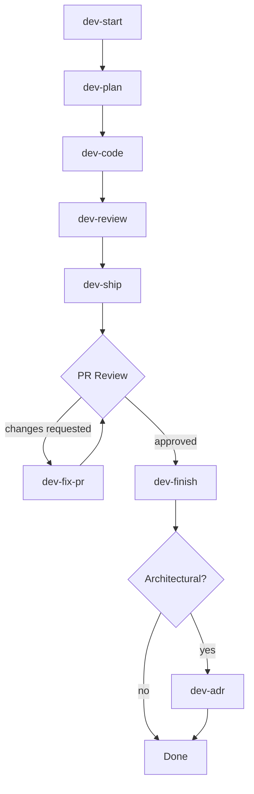

# Devflow Plugin

A self-contained AI workflow plugin for gitflow-based Jira task development. Automates the full lifecycle: start → plan → code → review → ship → fix → finish → document.



### Quick reference

```
dev-start KEY --→ gitflow branch + task folder
    │
devflow KEY --→ plan → code → review (3 phases, checkpoints)
    │              │        │
    │         dev-commit   dev-ship
    │         (grouped)    (PR + Jira)
    │              │
    │         dev-fix-pr --→ loop until approved
    │              │
    │         dev-finish --→ merge + cleanup
    │
    └── dev-adr (if architectural)

Always-on rules:   AGENTS.md → priorities, core, anti-hallucination, hard stops, privacy, confidence
On-demand rules:   coding-rules.md (code), pr-rules.md (reviews)
Personal:          .local/memory.md (shortcuts), .local/session-rules.md (tracking)
```

---

## Structure

```
devflow/
  config.md                   ← shared paths
  skills/
    1.dev-start/              ← create branch (gitflow default, --worktree for worktree)
    2.dev-plan/               ← analyze + create execution plan
    3.dev-code/               ← implement planned changes
    4.dev-review/             ← review code against plan + criteria
    5.dev-ship-pr-jira/       ← create PR + comment Jira + generate reports
    6.dev-fix-pr/             ← fix PR review comments (multi-round loop)
    7.dev-finish/             ← merge PR + delete branch + cleanup
    8.dev-adr/                ← create Architecture Decision Record
    dev-commit/               ← stage + commit in related groups
    dev-get/                  ← pull Jira issue into task folder
    dev-push/                 ← commit all + push to origin
```

---

## Skills

| # | Skill | Benefits | Example | Non-worktree? | Note |
|---|-------|----------|---------|:---:|---|
| 1 | `dev-start` | Isolated workspace or gitflow branch, auto branch | `dev-start PROJ-123` | ✅ | Gitflow default. `--worktree` for isolated folder. `--release` for release branches |
| 2 | `dev-plan` | Structured plan from task evidence + codebase | `/dev-plan PROJ-123` | ✅ | Works on any branch |
| 3 | `dev-code` | Reads plan, implements, writes changelog | `/dev-code` | ✅ | Works on any branch |
| 4 | `dev-review` | Review against plan + changelog, verdict | `/dev-review` | ✅ | Works on any branch |
| 5 | `dev-ship-pr-jira` | PR + Jira comment + reports | `/dev-ship` | ✅ | `--pr-only`, `--jira-only`, `--dry-run` |
| 6 | `dev-fix-pr` | Fix PR comments, multi-round loop | `/dev-fix-pr` | ✅ | Legacy branch fallback available |
| 7 | `dev-finish` | Merge PR + delete branch/worktree + cleanup | `/dev-finish` | ✅ | Gitflow default. `--worktree` for worktree cleanup |
| 8 | `dev-adr` | Architecture Decision Record from evidence | `/dev-adr PROJ-123` | ✅ | Skips non-architectural tasks |
| 9 | `dev-commit` | Stage + commit in related groups | `/dev-commit` | ✅ | Runs standalone or during dev-code |
| 10 | `dev-get` | Pull Jira issue into task folder | `/dev-get PROJ-123` | ✅ | Writes raw.md + task.md from templates |
| 11 | `dev-review-pr` | Review any PR across 8 quality dimensions | `/review-pr [URL]` | ✅ | No worktree needed, works on any PR |
| 12 | `dev-push` | Commit all + push to origin | `dpush` or `/dev-push` | ✅ | Delegates to dev-commit for staging |

---

## Pros

| Advantage | Detail |
|-----------|--------|
| **Self-contained** | All paths are relative to the plugin root. Move, copy, or share the entire folder — nothing breaks. |
| **Single config** | `config.md` defines all shared paths and templates. Change it once, every skill follows. |
| **Full lifecycle** | Covers every phase from branch creation to PR merge to archival documentation. |
| **Multi-round support** | `dev-fix-pr` loops until all review comments are resolved — no re-invocation needed. |
| **Checkpoint gating** | Every destructive step has a user checkpoint. Nothing is pushed, merged, or deleted without approval. |
| **Consistent conventions** | Same commit message format, branch naming, folder structure, and table layouts across all skills. |
| **Composable** | Use individual skills (`/dev-plan`, `/dev-ship`) or the full orchestrator (`/devflow`). |
| **Dry-run support** | `dev-start`, `dev-ship`, `dev-fix-pr`, and `dev-finish` support `--dry-run` to preview what would happen with no side effects. |
| **GraphQL-native** | PR operations use GitHub GraphQL API — no screen scraping, no brittle REST parsing. |
| **No squash-merge default** | `dev-finish` and `dev-ship-pr-jira` preserve full commit history. Merge strategy is configurable per repository. |
| **PR review on demand** | `/review-pr` reviews any PR (past or current) with a single URL. No worktree needed. Covers 8 quality dimensions with prioritized findings and a saved report. |

---

## Cons

| Limitation | Detail |
|------------|--------|
| **GitHub-only** | Uses `gh` CLI and GitHub GraphQL API. No GitLab/Bitbucket support. |
| **Jira-dependent** | Assumes Jira task keys (`PROJ-123`) for branch naming, task folders, and PR descriptions. |
| **Worktree** | `dev-start` and `dev-finish` default to gitflow mode. Use `--worktree` flag to switch to worktree mode when needed. |
| **50-thread limit** | GraphQL queries paginate at 50 review threads. Very large PRs may miss threads (pagination not yet implemented). |
| **Agent-dependent** | Skills are markdown instructions for AI agents — not executable scripts. Requires an AI tool that reads and follows them. |

---

## Usage

### Full pipeline (orchestrator)

```
/devflow PROJ-123
```

Runs plan → code → review in sequence with checkpoints between phases.
After review passes, use individual skills to continue the lifecycle (see table below).
Use flags to skip or retry specific phases:

```
/devflow PROJ-123 --plan-only     # re-plan without re-implementing
/devflow PROJ-123 --code-only      # retry implementation without re-planning
/devflow PROJ-123 --review-only    # re-run review without re-implementing
```

### Individual skills

| Trigger | What it does |
|---------|-------------|
| `/dev-start` or `devstart` | Create a branch from a Jira key. Gitflow mode by default (branch in main clone). `--worktree` for worktree mode. `--release` from `develop`, `--hotfix` from `main`, `--force` from current, `--dry-run` previews. |
| `/dev-plan` | Analyze task + codebase, produce `plan.md`. |
| `/dev-code` | Read `plan.md`, implement changes, capture manual changes, write `changelog.md` with `Delivery` tracking. |
| `/dev-review` | Review changes via `git diff`, check changelog for unlogged changes, write `review.md`, issue verdict. |
| `/dev-ship` or `/dev-ship-pr-jira` | Create PR + comment Jira. `--pr-only`, `--jira-only`, `--dry-run`, `--technical-only`, `--from-pr [URL]`. |
| `/dev-fix-pr` or `devfixpr` | List, plan, fix, and resolve PR review comments. Loops for multiple rounds. `--dry-run` available. |
| `/dev-finish` or `devfinish` | Merge approved PR, delete branch + cleanup. Gitflow mode by default. `--worktree` for worktree mode. `--worktree-only` skips PR. `--dry-run` previews. |
| `/dev-adr` or `adr` | Create an ADR from completed task evidence. Skips non-architectural tasks. |
| `/review-pr` or `/reviewpr` | Review a GitHub PR across multiple dimensions (fit, quality, naming, design, performance, security, testing). Provide a URL for any PR or run from a worktree to auto-detect the open PR. Generates a `pr-feedback-[KEY].md` report. |
| `/dev-push` or `dpush` | Commit all changes via dev-commit, then push to origin. Quick ship for WIP or small fixes. |

---

## Examples

### Start to finish

```bash
# 1. Start a new task (gitflow mode — default)
dev-start PROJ-2050

# 1b. Or start in worktree mode (isolated folder)
dev-start PROJ-2050 --worktree
cd ../proj-api-worktrees/proj-2050-login-google

# 1c. Or create a release branch
dev-start PROJ-3000 --release

# 2. Full pipeline (plan → code → review)
/devflow PROJ-2050

# 3. Ship the PR
/dev-ship PROJ-2050

# 4. Reviewer adds comments — fix them
/dev-fix-pr
# → fixes round 1, pushes, detects new comments → fixes round 2 → all resolved

# 5. PR approved — merge and clean up
/dev-finish

# 5b. Or finish in worktree mode
/dev-finish --worktree

# 6. Create ADR if architectural
/dev-adr PROJ-2050
```

### Generate reports from a past PR

```bash
/dev-ship --from-pr https://github.com/owner/repo/pull/456
# → shows Jira and PR reports without creating anything
```

### Dry-run before finishing

```bash
/dev-finish --dry-run
# → shows what would happen without making changes
```

---

## Related Plugins

Other plugins in this repo share the same `.env.local` and `.local/tasks/` structure. No extra setup.

| Plugin | What it does | Dependencies |
|--------|-------------|-------------|
| `githubflow` | Release listing, PR tools | git, gh CLI |
| `jiraflow` | Release notes, task management | JIRA creds |

---

## Integration

To use this plugin in a repository:

1. Copy `.ai/plugins/devflow/` into your repo's `.ai/plugins/` directory.
2. Ensure `config.md` paths match your repo conventions. Defaults:
   - Tasks: `.local/tasks/`
   - ADRs: `docs/adrs/`
3. Your AI tool reads `startup.md` → discovers `plugins/devflow/` → reads skills on demand.

To disable: remove or rename the `devflow/` folder.

### Recovery

If a phase fails mid-pipeline, re-run the orchestrator with a phase-specific flag:
- `--plan-only` — retry planning without re-implementing.
- `--code-only` — retry implementation without re-planning.
- `--review-only` — re-run the review without re-implementing.

---

## Design Conventions

| Convention | Example |
|------------|---------|
| Branch names | `feature/proj-2145-short-summary`, `hotfix/proj-2145-fix-crash`, `release/proj-3000-version-2-1-0` |
| Commit messages | `Fix PR comments PROJ-2145` |
| Task folder | `.local/tasks/PROJ-2145/` |
| ADR files | `docs/adrs/PROJ-2145-short-decision.md` |
| Checkpoint format | "Proceed? (yes / no / adjust)" with explicit consequences per option |
| Table columns | `#`, `St` (status), `File`, `Author`, `Comment`, `Change`/`Reply` |
