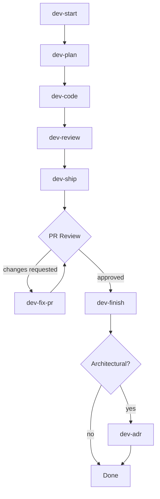

# Devflow Plugin

A self-contained AI workflow plugin for gitflow-based Jira task development. Automates the full lifecycle: start → plan → code → review → ship → fix → finish → document.



---

## Structure

```
devflow/
  config.md                   ← shared paths and templates
  agent.md                    ← orchestrator (full pipeline)
  templates/                  ← shared templates (plan, changelog, review, ADR)
  1.dev-start/                ← create worktree + branch
  2.dev-plan/                 ← analyze + create execution plan
  3.dev-code/                 ← implement planned changes
  4.dev-review/               ← review code against plan + criteria
  5.dev-ship-pr-jira/         ← create PR + comment Jira + generate reports
  6.dev-fix-pr/               ← fix PR review comments (multi-round loop)
  7.dev-finish/               ← merge PR + delete worktree + cleanup
  8.dev-adr/                  ← create Architecture Decision Record
  9.dev-review-pr/            ← review any PR (current or past) across multiple quality dimensions
```

---

## Pros

| Advantage | Detail |
|-----------|--------|
| **Self-contained** | All paths are relative to the plugin root. Move, copy, or share the entire folder — nothing breaks. |
| **Single config** | `config.md` defines all shared paths and templates. Change it once, every skill follows. |
| **Full lifecycle** | Covers every phase from worktree creation to PR merge to archival documentation. |
| **Multi-round support** | `dev-fix-pr` loops until all review comments are resolved — no re-invocation needed. |
| **Checkpoint gating** | Every destructive step has a user checkpoint. Nothing is pushed, merged, or deleted without approval. |
| **Consistent conventions** | Same commit message format, branch naming, folder structure, and table layouts across all skills. |
| **Composable** | Use individual skills (`/dev-plan`, `/dev-ship`) or the full orchestrator (`/devflow`). |
| **Dry-run support** | `dev-start`, `dev-ship`, `dev-fix-pr`, and `dev-finish` support `--dry-run` to preview what would happen with no side effects. |
| **GraphQL-native** | PR operations use GitHub GraphQL API — no screen scraping, no brittle REST parsing. |
| **No squash-merge default** | `dev-finish` and `dev-ship-pr-jira` preserve full commit history. Merge strategy is configurable per repository. |
| **PR review on demand** | `/review-pr` reviews any PR (past or current) with a single URL. No worktree needed. Covers 8 quality dimensions with prioritized findings and a saved report. |

---

## Cons

| Limitation | Detail |
|------------|--------|
| **GitHub-only** | Uses `gh` CLI and GitHub GraphQL API. No GitLab/Bitbucket support. |
| **Jira-dependent** | Assumes Jira task keys (`PROJ-123`) for branch naming, task folders, and PR descriptions. |
| **Worktree required** | `dev-start` and `dev-finish` assume git worktree workflow. Legacy branch fallback in `dev-fix-pr` only. |
| **50-thread limit** | GraphQL queries paginate at 50 review threads. Very large PRs may miss threads (pagination not yet implemented). |
| **Agent-dependent** | Skills are markdown instructions for AI agents — not executable scripts. Requires an AI tool that reads and follows them. |

---

## Usage

### Full pipeline (orchestrator)

```
/devflow PROJ-123
```

Runs plan → code → review in sequence with checkpoints between phases.
After review passes, use individual skills to continue the lifecycle (see table below).
Use flags to skip or retry specific phases:

```
/devflow PROJ-123 --plan-only     # re-plan without re-implementing
/devflow PROJ-123 --code-only      # retry implementation without re-planning
/devflow PROJ-123 --review-only    # re-run review without re-implementing
```

### Individual skills

| Trigger | What it does |
|---------|-------------|
| `/dev-start` or `devstart` | Create a worktree from a Jira key. Fetches latest base branch, copies `.env` to worktree. `--hotfix` branches from `main`, `--force` from current, `--dry-run` previews. |
| `/dev-plan` | Analyze task + codebase, produce `plan.md` + `progress.md`. |
| `/dev-code` | Read `plan.md`, implement changes, capture manual changes, write `changelog.md` with `Delivery` tracking. |
| `/dev-review` | Review changes via `git diff`, check changelog for unlogged changes, write `review.md`, issue verdict. |
| `/dev-ship` or `/dev-ship-pr-jira` | Create PR + comment Jira. `--pr-only`, `--jira-only`, `--dry-run`, `--technical-only`, `--from-pr [URL]`. |
| `/dev-fix-pr` or `devfixpr` | List, plan, fix, and resolve PR review comments. Loops for multiple rounds. `--dry-run` available. |
| `/dev-finish` or `devfinish` | Merge approved PR, delete worktree + branch. `--worktree-only` skips PR. `--dry-run` previews. |
| `/dev-adr` or `adr` | Create an ADR from completed task evidence. Skips non-architectural tasks. |
| `/review-pr` or `/reviewpr` | Review a GitHub PR across multiple dimensions (fit, quality, naming, design, performance, security, testing). Provide a URL for any PR or run from a worktree to auto-detect the open PR. Generates a `pr-feedback-[KEY].md` report. |

---

## Examples

### Start to finish

```bash
# 1. Start a new task
dev-start PROJ-2050
cd ../proj-worktrees/proj-2050-login-google

# 2. Full pipeline (plan → code → review)
/devflow PROJ-2050

# 3. Ship the PR
/dev-ship PROJ-2050

# 4. Reviewer adds comments — fix them
/dev-fix-pr
# → fixes round 1, pushes, detects new comments → fixes round 2 → all resolved

# 5. PR approved — merge and clean up
/dev-finish

# 6. Create ADR if architectural
/dev-adr PROJ-2050
```

### Generate reports from a past PR

```bash
/dev-ship --from-pr https://github.com/owner/repo/pull/456
# → shows Jira and PR reports without creating anything
```

### Dry-run before deleting a worktree

```bash
/dev-finish --dry-run
# → shows what would happen without making changes
```

---

## Integration

To use this plugin in a repository:

1. Copy `.ai/plugins/devflow/` into your repo's `.ai/plugins/` directory.
2. Ensure `config.md` paths match your repo conventions. Defaults:
   - Tasks: `.local/tasks/`
   - ADRs: `docs/adrs/`
3. Your AI tool reads `startup.md` → discovers `plugins/devflow/` → reads skills on demand.

To disable: remove or rename the `devflow/` folder.

### Recovery

If a phase fails mid-pipeline, re-run the orchestrator with a phase-specific flag:
- `--plan-only` — retry planning without re-implementing.
- `--code-only` — retry implementation without re-planning.
- `--review-only` — re-run the review without re-implementing.

---

## Design Conventions

| Convention | Example |
|------------|---------|
| Branch names | `feature/proj-2145-short-summary` or `hotfix/proj-2145-fix-crash` |
| Commit messages | `Fix PR comments #PROJ-2145` |
| Task folder | `.local/tasks/PROJ-2145/` |
| ADR files | `docs/adrs/PROJ-2145-short-decision.md` |
| Checkpoint format | "Proceed? (yes / no / adjust)" with explicit consequences per option |
| Table columns | `#`, `St` (status), `File`, `Author`, `Comment`, `Change`/`Reply` |
