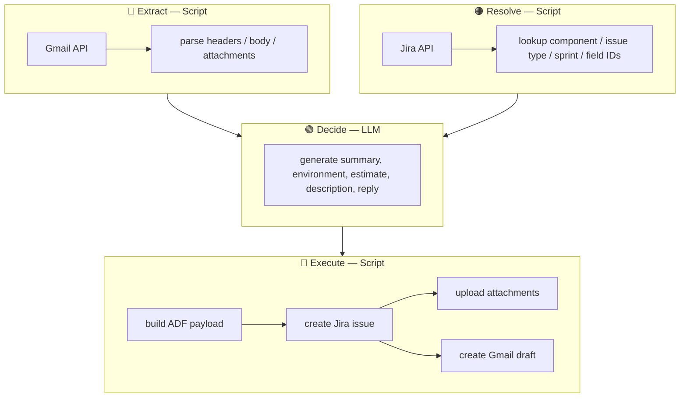
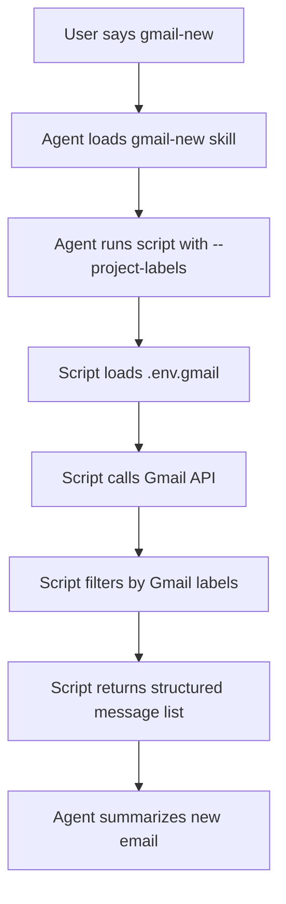
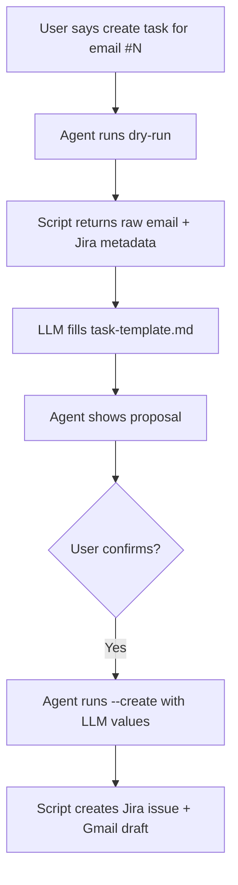

# GmailFlow Plugin

Gmail workflow skills for reading and summarizing new email, and creating Jira tasks from Gmail messages.

## Structure

```text
gmailflow/
  config.md                    ← shared Gmail auth/config conventions
  skills/
    gmail-new/
      SKILL.md                 ← read and summarize new Gmail messages
      scripts/
        main.py                ← Gmail API reader
    gmail-jira/
      SKILL.md                 ← create Jira task from email + draft reply
      templates/
        task-template.md       ← description template (LLM fills)
        reply-template.md      ← reply draft templates
      scripts/
        main.py                ← CLI: proposal, create, draft
        actions.py             ← attachment upload, reply draft creation
        email_content.py       ← email parsing (extract, clean, classify)
        proposal_builder.py    ← ID lookups (component, issue type)
        gmail_client.py        ← Gmail API client
        config_store.py        ← local config (jira-fields, name-map)
        errors.py              ← structured error helpers
```

## Skills

| # | Skill | Description | Triggers |
|---|-------|-------------|----------|
| 1 | `gmail-new` | Read and summarize new Gmail messages | `gmail-new`, `new gmail` |
| 2 | `gmail-jira` | Create Jira task from email + draft reply | `gmail-jira`, `email to jira` |

## Architecture — 4 Layers

Scripts are data pipelines, not content generators. LLM decides what to say; scripts extract, resolve, and execute.



| Layer | Who | Responsibility |
|---|---|---|
| Extract | Script | Fetch raw data from Gmail (headers, body, attachments) |
| Resolve | Script | Look up Jira IDs (component, issue type, sprint, custom fields) |
| Decide | **LLM** | Generate all content: summary, environment, estimate, description, reply |
| Execute | Script | Build ADF payload, call Jira/Gmail APIs, upload files |

### Script rules

- Never guess issue type, component, or priority from keywords.
- Never build summaries, descriptions, replies, or acceptance criteria.
- All content values enter via CLI args (`--summary`, `--description`, `--environment`, `--reply-body`, `--estimate`).
- Empty string is better than a wrong guess. No content fallbacks in script code.

## Gmail New Flow



## Gmail Jira Flow



## Environment file

This plugin reads credentials from:

- `.env.gmail` — Gmail OAuth credentials
- `.env.jira` — Jira API credentials

Expected variables:

```env
# .env.gmail
GOOGLE_CLIENT_ID=...
GOOGLE_CLIENT_SECRET=...
GOOGLE_REFRESH_TOKEN=...
GMAIL_ACCOUNT=you@example.com

# .env.jira
JIRA_COMPANY_DOMAIN=...
JIRA_EMAIL=...
JIRA_API_TOKEN=...
```

## Local config

- `.local/gmailflow/project-labels.txt` — Gmail label to project mappings
- `.local/gmailflow/jira-fields.json` — cached Jira custom field IDs
- `.local/gmailflow/name-map.txt` — sender email to friendly name

## Notes

- Do not commit `.env.gmail` or `.env.jira`.
- Start with least-privilege Gmail scopes where possible.
- If `GOOGLE_REFRESH_TOKEN` is missing, the script cannot read mail yet and should report setup is incomplete.
