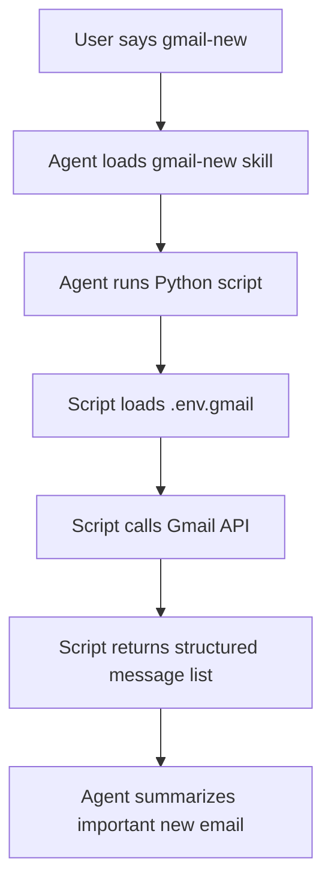

# GmailFlow Plugin

Gmail workflow skills for reading and summarizing new email through Gmail API-based tooling.

## Structure

```text
gmailflow/
  config.md                    ← shared Gmail auth/config conventions
  skills/
    gmail-new/
      SKILL.md                 ← read and summarize new Gmail messages
      scripts/
        main.py                ← Gmail API reader
        get_refresh_token.py   ← local OAuth helper to get refresh token
```

## Skills

| # | Skill | Benefits | Example |
|---|-------|----------|---------|
| 1 | `gmail-new` | Read and summarize new Gmail messages | `gmail-new` |

## Gmail New Flow



## Environment file

This plugin reads Gmail credentials from:

- `.env.gmail` ở repo root

Expected variables:

```env
GOOGLE_CLIENT_ID=...
GOOGLE_CLIENT_SECRET=...
GOOGLE_REFRESH_TOKEN=...
GMAIL_ACCOUNT=you@example.com
```

## Notes

- Do not commit `.env.gmail`.
- Start with least-privilege Gmail scopes where possible.
- If `GOOGLE_REFRESH_TOKEN` is missing, the script cannot read mail yet and should report setup is incomplete.
