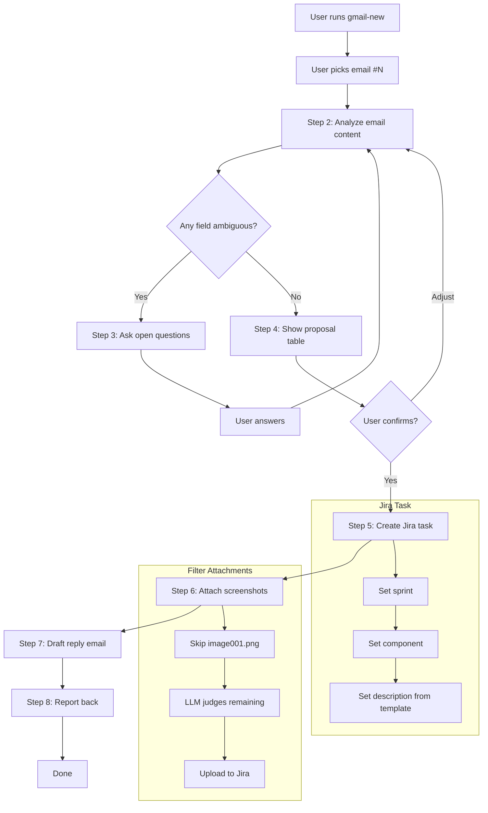
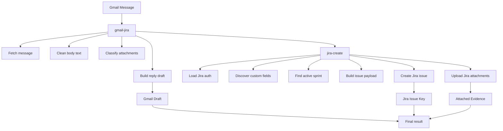

# gmail-jira

Create a Jira task from a Gmail message + draft reply with task ID.

## User flow



## Internal split



## Files

| File | Purpose |
|------|---------|
| `SKILL.md` | Full skill instructions (8 steps) |
| `templates/task-template.md` | Description template for Jira issues |
| `templates/reply-template.md` | Reply email body template |
| `scripts/main.py` | CLI entry point for proposal/create/draft flow |
| `scripts/*.py` | Gmail, Jira, ADF, and local config helpers |
| `README.md` | This file |

## Run

```bash
py.exe .ai/plugins/gmailflow/skills/gmail-jira/scripts/main.py --message-id 19e998921ffdd593 --project DEMOP --component "Field App"
py.exe .ai/plugins/gmailflow/skills/gmail-jira/scripts/main.py --message-id 19e998921ffdd593 --project DEMOP --component "Field App" --create --dry-run
py.exe .ai/plugins/gmailflow/skills/gmail-jira/scripts/main.py --message-id 19e998921ffdd593 --project DEMOP --component "Field App" --create
py.exe .ai/plugins/gmailflow/skills/gmail-jira/scripts/main.py --message-id 19e998921ffdd593 --project DEMOP --component "Field App" --create-draft --issue-key DEMOP-2197
```

## Dependencies

- **Gmail API** — `gmail.readonly` + `gmail.compose` scopes
- **Jira API** — REST v3 + Agile API
- `.env.gmail` — Google OAuth credentials
- `.env.jira` — Jira credentials
