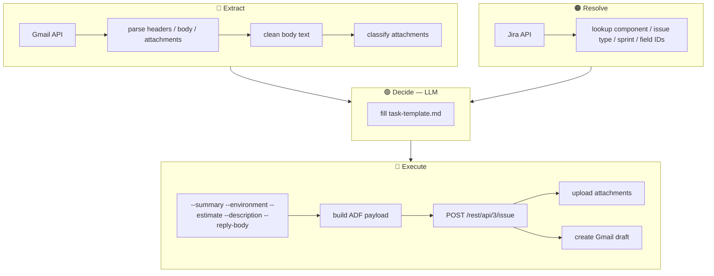
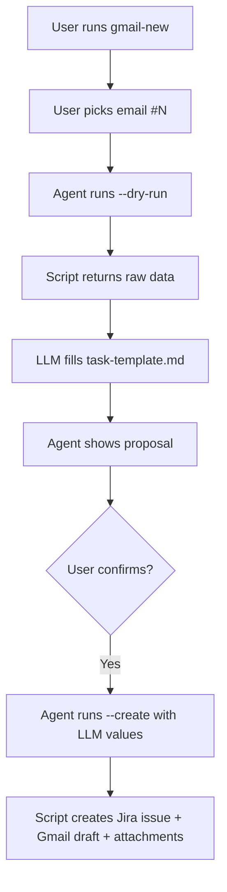

# gmail-jira

Create a Jira task from a Gmail message + draft reply with task ID.

## Architecture

Scripts extract and execute. LLM decides content. 4-layer split:



## User flow



## Script — zero content generation

Scripts never guess content. All values enter via CLI args:

| CLI arg | Purpose | Who provides |
|---|---|---|
| `--project` | Jira project key | LLM |
| `--component` | Jira component name | LLM |
| `--issue-type` | Bug / Task / Story | LLM |
| `--summary` | Issue summary | LLM |
| `--environment` | Environment text | LLM |
| `--estimate` | Hours estimate | LLM |
| `--description` | ADF JSON (from template) | LLM |
| `--reply-body` | Gmail draft text | LLM |

Empty string > wrong guess. No fallbacks in code.

## Files

| File | Purpose |
|------|---------|
| `SKILL.md` | Full skill instructions |
| `templates/task-template.md` | Description template — LLM fills. Bug → Steps to Reproduce, Task/Story → What to Do |
| `templates/reply-template.md` | Reply email templates (Normal / ASAP / More info) |
| `scripts/main.py` | CLI entry — proposal, create, draft |
| `scripts/email_content.py` | Email parsing — extract text, collect/classify attachments |
| `scripts/proposal_builder.py` | ID lookups — component, issue type (no generation) |
| `scripts/actions.py` | Side effects — upload attachments, create reply draft |
| `scripts/gmail_client.py` | Gmail API client |
| `scripts/config_store.py` | Local config — jira-fields, name-map |
| `scripts/errors.py` | Structured error helpers |
| `README.md` | This file |

## Run

```bash
# Dry-run — returns raw data for LLM
py.exe .ai/plugins/gmailflow/skills/gmail-jira/scripts/main.py \
  --message-id MSG_ID --project RMASUP --component LIMS --issue-type Task \
  --dry-run --json

# Create — with LLM-generated values
py.exe .ai/plugins/gmailflow/skills/gmail-jira/scripts/main.py \
  --message-id MSG_ID --project RMASUP --component LIMS --issue-type Task \
  --summary "[LIMS] - Load test data" \
  --environment "Production LIMS" \
  --estimate 4 \
  --description '{"type":"doc","version":1,"content":[...]}' \
  --reply-body "Hi Joe, ..." \
  --create --create-draft --upload-attachments --json
```

## Dependencies

- **Gmail API** — `gmail.readonly` + `gmail.compose` scopes
- **Jira API** — REST v3 + Agile API
- `.env.gmail` — Google OAuth credentials
- `.env.jira` — Jira credentials
- `.local/gmailflow/` — jira-fields.json, name-map.txt, project-labels.txt
