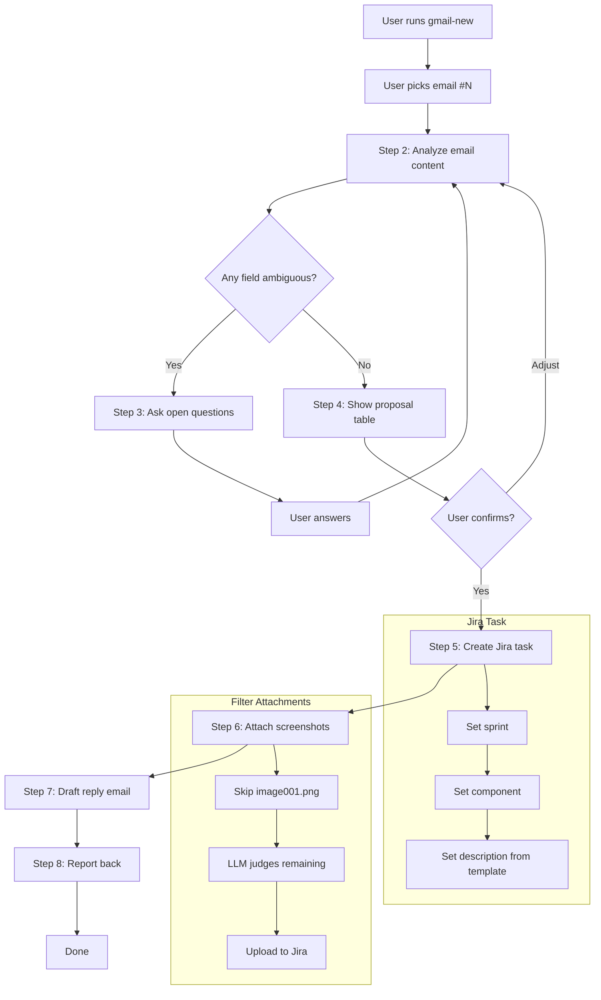

# gmail-jira

Create a Jira task from a Gmail message + draft reply with task ID.

## Files

| File | Purpose |
|------|---------|
| `SKILL.md` | Full skill instructions (8 steps) |
| `templates/task-template.md` | Description template for Jira issues |
| `templates/reply-template.md` | Reply email body template |
| `README.md` | This file |

## Dependencies

- **Gmail API** — `gmail.readonly` + `gmail.compose` scopes
- **Jira API** — REST v3 + Agile API
- `.env.gmail` — Google OAuth credentials
- `.env.jira` — Jira credentials
