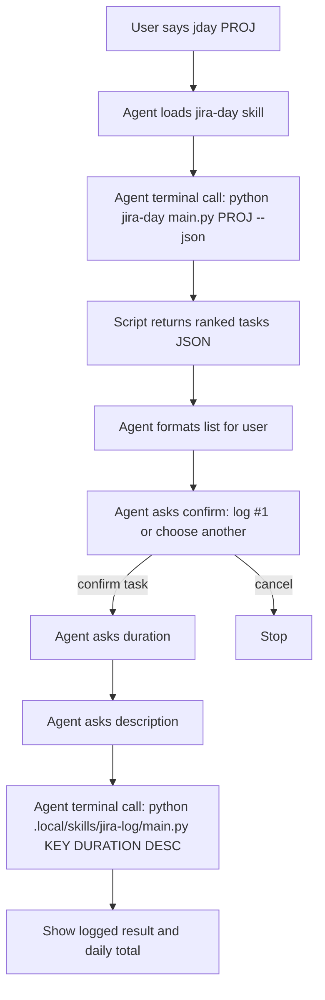
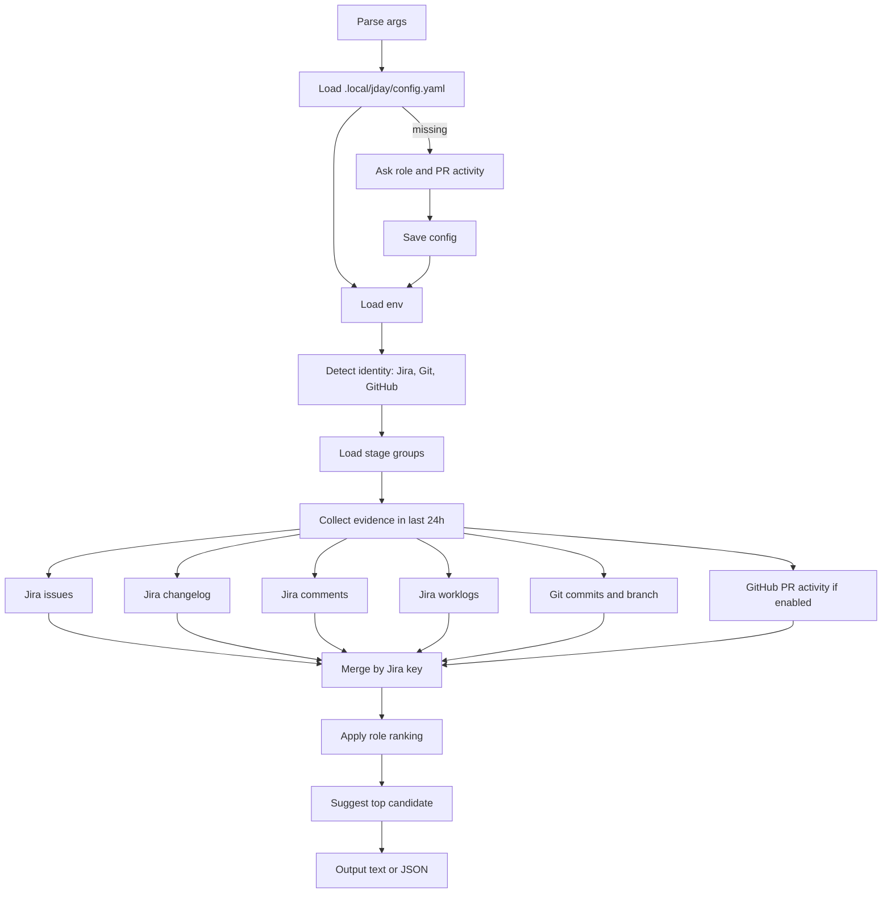

# JiraFlow Plugin

JIRA workflow skills for task management and release operations.

## Structure

```
jiraflow/
  config.md                   ← shared transitions and milestones
  skills/
    jira-urgent/              ← list tasks waiting on your reply
    jira-mine/                ← list your assigned tasks
    jira-day/                 ← find tasks you touched in last 24h
    jira-comment/             ← post a comment to a JIRA issue
    jira-move/                ← transition issue between statuses
    release-add/              ← add task(s) to a JIRA release version
    release-note/             ← generate client-friendly release notes
```

## Skills

| # | Skill | Benefits | Example |
|---|-------|----------|---------|
| 1 | `jira-mine` | List your assigned tasks, ordered by priority | `jira-mine` or `jmine` |
| 2 | `jira-urgent` | Find tasks where team is waiting on you | `jira-urgent` |
| 3 | `jira-day` | Find Jira tasks you touched in the last 24h and suggest the best one to log | `jday` or `jira-day` |
| 4 | `jira-comment` | Post comment to JIRA issue | `jira-comment PROJ-123` |
| 5 | `jira-move` | Transition issue between statuses | `jira-move PROJ-123 "In Review"` |
| 6 | `release-add` | Add task to JIRA release version | `release-add PROJ-2143 "API next version"` |
| 7 | `release-note` | Generate client-facing release note | `release-note "API next version"` |

## Jira Day Flow

### Agent flow



### Script flow



### Agent tool calls

| Step | Tool |
|---|---|
| Load skill/docs | `read_file` |
| Run `jira-day` | `terminal` |
| Show result | chat response |
| Run `jlog` after confirmation | `terminal` |

### Script external calls

| Source | Call type |
|---|---|
| Jira auth and issue APIs | HTTP |
| Git commit and branch scan | subprocess: `git` |
| GitHub PR activity | subprocess: `gh` |
| Existing local worklogs | local file read |

## Jira API Token Setup

JiraFlow skills read credentials from `.env.jira` (preferred) or `.env` in the repo root.

### Required variables

```env
JIRA_COMPANY_DOMAIN=saritasa
JIRA_EMAIL=you@example.com
JIRA_API_TOKEN=your_api_token_here
JIRA_PROJECT_KEY=PROJ
TEMPO_API_TOKEN=your_tempo_token_here
```

> `TEMPO_API_TOKEN` is required by `jira-log` for logging time. Other skills work without it.

### How to get the Jira API token

1. Sign in to your Atlassian account.
2. Open: `https://id.atlassian.com/manage-profile/security/api-tokens`
3. Click **Create API token**.
4. Give it a label like `devflow jiraflow`.
5. Copy the generated token.
6. Save it to `.env.jira` as `JIRA_API_TOKEN`.

### How to get the Tempo API token

1. Sign in to your Atlassian account.
2. Open: `https://app.tempo.io/4/settings/api-integration`
3. Click **Generate API Token**.
4. Copy the generated token.
5. Save it to `.env.jira` as `TEMPO_API_TOKEN`.

### Notes

- `JIRA_COMPANY_DOMAIN` is your Atlassian subdomain only, for example `saritasa` for `https://saritasa.atlassian.net`.
- Use your Atlassian login email for `JIRA_EMAIL`.
- Keep `.env.jira` private and never commit API tokens.

## Favorite Projects

Set your favorite project keys once, and `jday`, `jmine`, and `jurgent` will auto-loop through all of them when no project key is given.

### Config

Create `.local/jiraflow/config.yaml` (gitignored):

```yaml
favorite_projects: [PROJ, COAPS]
```

### Behavior

| Command | Result |
|---|---|
| `jday` | loops all favorites, merges ranked candidates |
| `jmine` | loops all favorites, merges task lists |
| `jurgent` | loops all favorites, merges urgent items |
| `jday PROJ` | single project (overrides favorites) |
| `jmine PROJ` | single project (overrides favorites) |
| `jurgent PROJ` | single project (overrides favorites) |
