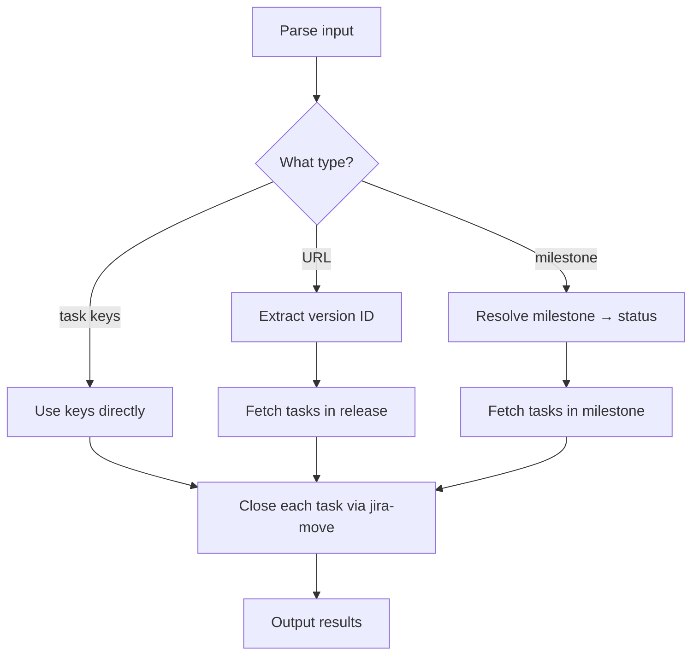

# jira-close

Close Jira tasks by key, milestone, or release URL.

## 1. Quick start

```bash
jclose PROJ-123                    # single task
jclose PROJ-123 PROJ-124           # multiple tasks
jclose PROJ review                 # all tasks in review milestone
jclose https://<domain>.atlassian.net/projects/PROJ/versions/12345  # by release
```

## 2. Output

```text
Closing 3 tasks from milestone "review":
- PROJ-123 → Closed ✅
- PROJ-124 → Closed ✅
- PROJ-125 → Closed ✅
```

## 3. Setup

Same `.env.jira` and `.local/jiraflow/config.yaml` as other jiraflow skills. Milestone mappings in `jira-move/RMASUP.config` (project-specific).

## 4. Flow



### External calls

| Source | Call type |
|---|---|
| Jira REST API | HTTP GET search, POST transitions |
| `jira-move` skill | delegates transitions |

## 5. File structure

```text
skills/jira-close/
  SKILL.md    ← skill description + workflow
  README.md   ← this file
```
