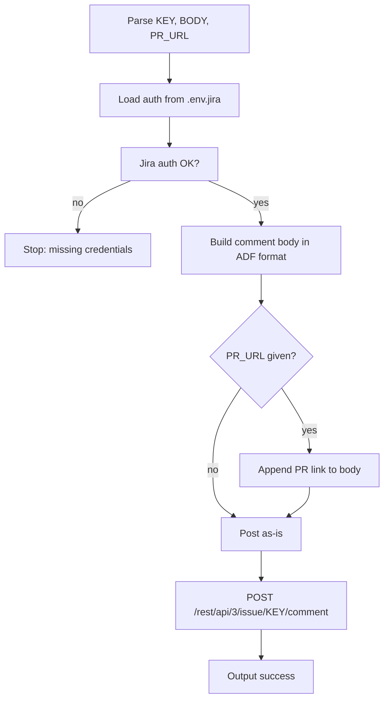

# jira-comment

Post a comment to a Jira issue with an optional PR link.

## 1. Quick start

```bash
jira-comment PROJ-123 "Reviewed and approved. Ready for QA."
jira-comment PROJ-123 "Fix deployed." https://github.com/owner/repo/pull/42
```

## 2. Output

```text
✅ Comment posted to PROJ-123
```

## 3. Setup

Same `.env.jira` as other jiraflow skills. No additional config needed.

## 4. Flow



### External calls

| Source | Call type |
|---|---|
| Jira REST API | HTTP POST comment |

## 5. File structure

```text
skills/jira-comment/
  SKILL.md    ← skill description + workflow
  README.md   ← this file
```
