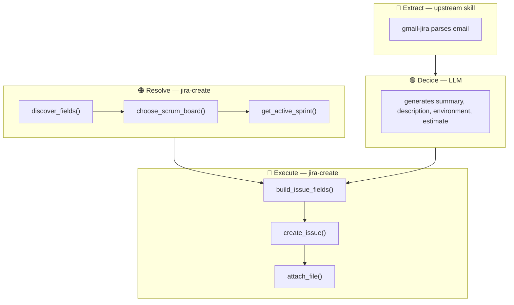
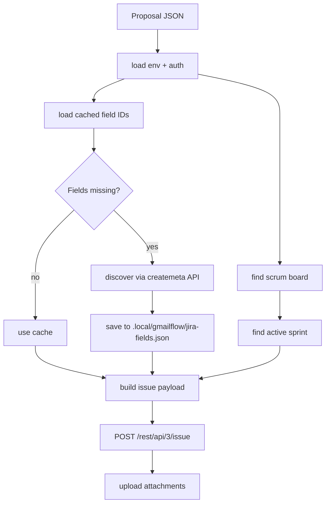

# jira-create

Create Jira issues with field discovery, sprint lookup, and payload build. Thin wrapper — all content decisions happen upstream.

## Architecture

Scripts process data, not generate content. 4-layer split:



## Flow



## Files

| File | Purpose |
|---|---|
| `SKILL.md` | Skill instructions |
| `scripts/main.py` | CLI entry — load proposal JSON, create issue |
| `../../shared/jira_api.py` | Jira REST client |
| `../../shared/create_flow.py` | Field discovery, sprint lookup, ADF, payload build |
| `../../shared/common.py` | Env loader + field cache |
| `README.md` | This file |

## Run

```bash
py.exe .ai/plugins/jiraflow/skills/jira-create/scripts/main.py --proposal proposal.json
```

## Dependencies

- `../../shared/` — shared jiraflow modules
- `.env.jira` — Jira credentials
- `.local/gmailflow/jira-fields.json` — cached custom field IDs

## Used by

- `gmail-jira` — passes LLM-generated proposal, jira-create handles Jira API
