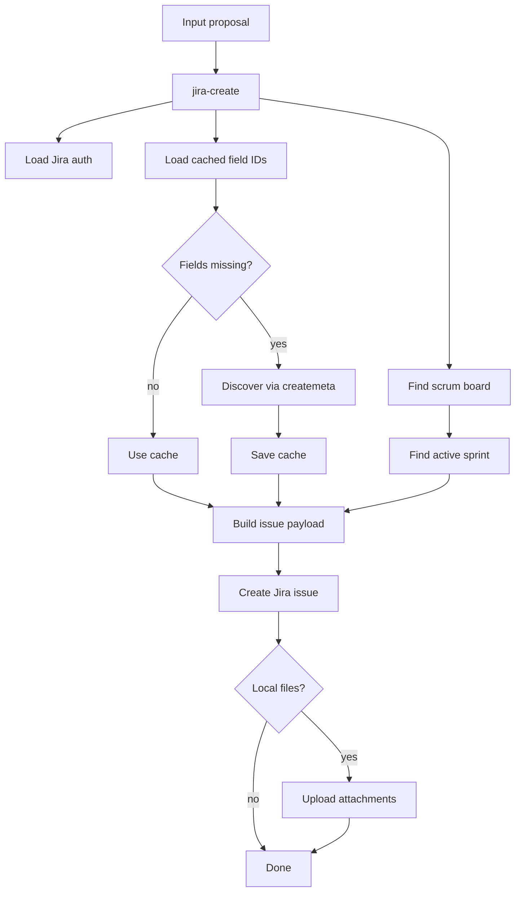

# jira-create

Create Jira issues with field discovery, sprint lookup, payload build, and attachment upload.

## Flow



## Files

| File | Purpose |
|---|---|
| `SKILL.md` | Skill instructions |
| `scripts/common.py` | Env load + Jira field cache |
| `scripts/jira_api.py` | Jira REST client |
| `scripts/create_flow.py` | Field discovery, sprint lookup, payload build, create/upload |
| `scripts/main.py` | CLI entry for proposal-based create |
| `README.md` | This file |

## Run

```bash
py.exe .ai/plugins/jiraflow/skills/jira-create/scripts/main.py --proposal proposal.json
```

## Notes

- Field cache path: `.local/gmailflow/jira-fields.json`
- Auth path: `.env.jira`
- Used by `gmail-jira` for Jira-side actions
