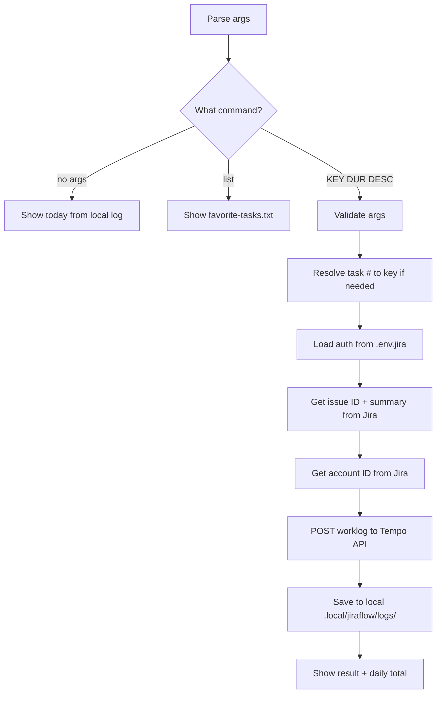

# jira-log

Log time to a Jira issue via Tempo. Shows daily total after logging.

## 1. Quick start

```bash
jlog                              # show today's hours
jlog list                         # show quick-pick task list
jlog 1 30m Email                  # log 30m to task #1 from favorite-tasks.txt
jlog PROJ-123 1h Code review       # log directly by key
jlog PROJ-123 1h --job Dev "Coding"  # with custom job type
```

## 2. Output

```text
✅ Logged 30m to PROJ-123 — "Email handle"
   tempoWorklogId: 1234567

## 2026-06-04: 1h 30m (3 entries)

| # | Issue | Time | Description |
|---|-------|------|-------------|
| 1 | PROJ-123 | 30m | Email handle |
| 2 | PROJ-124 | 30m | Code review |
| 3 | PROJ-1 | 30m | TM activities |
```

## 3. Setup

### Required env vars (`.env.jira`)

```env
JIRA_COMPANY_DOMAIN=saritasa
JIRA_EMAIL=you@example.com
JIRA_API_TOKEN=your_token
JIRA_PROJECT_KEY=PROJ
TEMPO_API_TOKEN=your_tempo_token
JLOG_JOB_TYPE=Testingfunctionality
```

### Favorite tasks

Create `.local/jiraflow/favorite-tasks.txt`:

```text
1. TM activities [PROJ-1](https://<domain>.atlassian.net/browse/PROJ-1)
2. QA meeting [PROJ-2](https://<domain>.atlassian.net/browse/PROJ-2)
```

Then: `jlog 1 30m "..."` picks task #1.

## 4. Flow



### External calls

| Source | Call type | Purpose |
|---|---|---|
| Jira REST API | HTTP GET | Issue ID, summary, account ID |
| Tempo API | HTTP POST | Create worklog |
| `.local/jiraflow/favorite-tasks.txt` | local file | Quick-pick task list |
| `.local/jiraflow/logs/` | local file | Daily total tracking |

## 5. File structure

```text
skills/jira-log/
  SKILL.md    ← skill description + workflow + rules
  SKILL.html  ← HTML preview
  README.md   ← this file
  main.py     ← entry point, self-contained script
```
