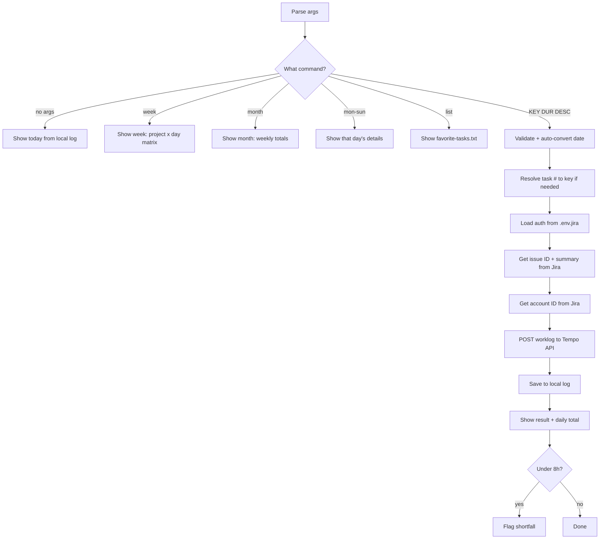

# jira-log

Log time to a Jira issue via Tempo. Shows daily totals, weekly project breakdowns, and month views. Auto-flags days under 8h.

## 1. Quick start

```bash
jlog                              # show today's hours
jlog week                         # weekly project/day breakdown
jlog month                        # month view with weekly totals
jlog mon                          # Monday's detail (mon-sun)
jlog list                         # show quick-pick task list
jlog 1 30m Email                  # log 30m to task #1 from favorite-tasks.txt
jlog PROJ-123 1h Code review      # log directly by key
jlog PROJ-123 1h --date 6/5 "..." # log to a past date (M/D, YYYY-MM-DD, YYYY/M/D)
jlog PROJ-123 1h --job Dev "..."  # with custom job type
```

## 2. Output

### Log entry

✅ Logged 30m to PROJ-123 — "Email handle"
   tempoWorklogId: 1234567

#### 2026-06-04: 1h 30m (3 entries)

| # | Issue | Time | Description |
|---|-------|------|-------------|
| 1 | PROJ-123 | 30m | Email handle |

Under 8h days get a warning: `2026-06-04: 1h 30m logged - 6h 30m short of 8h`

### Week view (`jlog week`)

| Project | Mon | Tue | Wed | Thu | Fri | Sat | Sun | Total |
|---|---|---|---|---|---|---|---|---|
| **MISC** | 5h 30m | 5h 20m | 6h | 5h | 3h | — | — | 24h 50m |
| **RMASUP** | 2h 30m | 3h | 2h | 3h | 3h 30m | — | — | 14h |
| **Total** | 8h | 8h 20m | 8h | 8h | 6h 30m | — | — | 38h 50m |

Fri 2026-06-05: 6h 30m logged - 1h 30m short of 8h

### Month view (`jlog month`)

**June 2026 — up to Jun 06**

| Week | Mon | Tue | Wed | Thu | Fri | Sat | Sun | Total |
|------|-----|-----|-----|-----|-----|-----|-----|-------|
| Jun 01-06 | 8h | 8h 20m | 8h | 8h | 8h | — | | 40h 20m |
| **Total** | 8h | 8h 20m | 8h | 8h | 8h | — | — | 40h 20m |

All views read from local log files — no API calls.

## 3. Setup

### Required env vars (`.env.jira`)

```env
JIRA_COMPANY_DOMAIN=saritasa
JIRA_EMAIL=you@example.com
JIRA_API_TOKEN=your_token
JIRA_PROJECT_KEY=PROJ
TEMPO_API_TOKEN=your_tempo_token
JLOG_JOB_TYPE=Testingfunctionality
```

### Favorite tasks

Create `.local/jiraflow/favorite-tasks.txt`:

```text
1. TM activities [PROJ-1](https://<domain>.atlassian.net/browse/PROJ-1)
2. QA meeting [PROJ-2](https://<domain>.atlassian.net/browse/PROJ-2)
```

Then: `jlog 1 30m "..."` picks task #1.

## 4. Flow



### External calls

| Source | Call type | Purpose |
|---|---|---|
| Jira REST API | HTTP GET | Issue ID, summary, account ID |
| Tempo API | HTTP POST | Create worklog |
| `.local/jiraflow/favorite-tasks.txt` | local file | Quick-pick task list |
| `.local/jiraflow/logs/` | local file | Daily/week/month totals |

## 5. File structure

```text
skills/jira-log/
  SKILL.md    ← skill description + workflow + rules
  SKILL.html  ← HTML preview
  README.md   ← this file
  README.html ← HTML preview
  main.py     ← entry point, self-contained script
```
