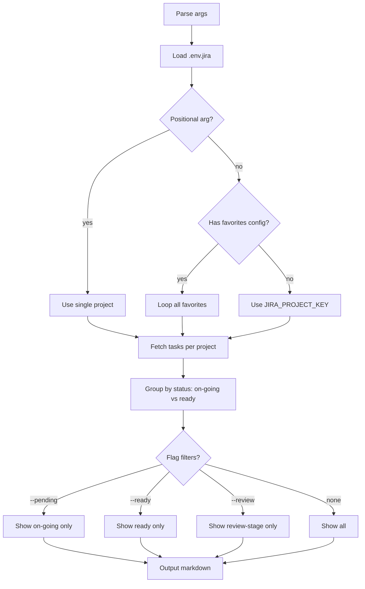

# jira-mine

List your assigned Jira tasks, ordered by priority and grouped by status.

## 1. Quick start

```bash
jmine                      # all assigned, grouped by status
jmine --pending            # on-going only
jmine --ready              # ready / backlog only
jmine --review             # tasks in review status
jmine RMASUP               # specific project
```

No project key given → auto-loops through favorites from `.local/jiraflow/config.yaml`.

## 2. Output

```text
# Jira - My Tasks: PROJ (2026-06-04)

**18 pending** (8 on-going, 10 ready, 0 ignored)

## On-Going (8)

### 1. PROJ-123 — Highest | TM Review
**Summary of the task:**

Description of the task with context and details...

### 2. PROJ-124 — High | Blocked
**Another task summary:**

More description text...

## Ready for Development (10)

### 1. PROJ-125 — High
**Ready task summary:**

Description...
```

## 3. Setup

### Required env vars (`.env.jira`)

```env
JIRA_COMPANY_DOMAIN=saritasa
JIRA_EMAIL=you@example.com
JIRA_API_TOKEN=your_token
JIRA_PROJECT_KEY=PROJ
```

### Favorite projects

Reads from `.local/jiraflow/config.yaml`:

```yaml
favorite_projects: [RMASUP, COAPS]
```

### Ignore list

Skill-local `.ai/plugins/jiraflow/skills/jira-mine/ignore-tasks.txt`:

```
RMASUP-123
RMASUP-456
```

One task key per line. These tasks won't appear in the output.

## 4. Flow



### External calls

| Source | Call type | Purpose |
|---|---|---|
| Jira REST API | HTTP POST | Search issues by assignee + sprint |
| `.local/jiraflow/config.yaml` | local file | Read favorite projects |
| `ignore-tasks.txt` | local file | Skip ignored task keys |

## 5. How it works

Queries Jira for `assignee = currentUser()` in open sprints, sorted by priority. Groups tasks into:

| Group | Statuses |
|---|---|
| On-Going | In Progress, Code Review, TM Review, In Review, Blocked, On Hold |
| Ready | Ready for Development, Open, To Do, Reopened |

Excludes: Completed, Done, Closed, Resolved, On Production, On Staging, Backlog.

## 6. Flags

| Flag | Effect |
|---|---|
| `--pending` | Show on-going only |
| `--ready` | Show ready only |
| `--review` | Filter on-going to In Review / TM Review |

## 7. File structure

```text
skills/jira-mine/
  SKILL.md           ← skill description + triggers
  README.md          ← this file
  scripts/
    main.py          ← entry point, single self-contained script
  ignore-tasks.txt   ← task keys to exclude, one per line
```
