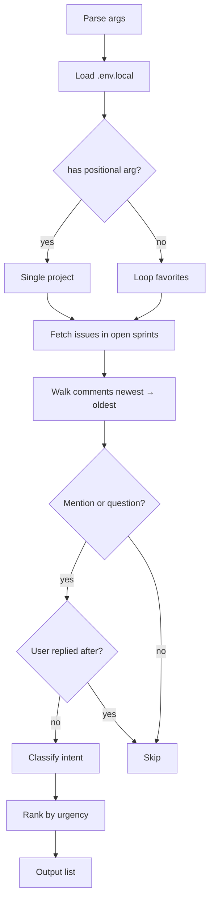

# jira-urgent

Find Jira tasks where the team is waiting on you. Detects unanswered mentions and questions, drafts replies.

## 1. Quick start

```bash
jurgent                   # auto-loops favorites
jurgent RMASUP            # specific project
```

## 2. Output

```text
# Jira - Urgent Tasks: PROJ (2026-06-04)

**3 urgent** (1 ignored)

- PROJ-123 — Code Review | Highest | Alice (at_mention)
- PROJ-124 — TM Review | High | Bob (verify)
- PROJ-125 — In Progress | Medium | Carol (question)

3 urgent, 1 ignored
```

## 3. Setup

Uses same `.env.local` and `.local/jiraflow/config.yaml` as other jiraflow skills. Ignore list at `skills/jira-urgent/ignored-comments.txt` — one comment ID per line.

## 4. Flow



### External calls

| Source | Call type |
|---|---|
| Jira REST API | HTTP POST search, GET myself |
| `ignored-comments.txt` | local file |

## 5. File structure

```text
skills/jira-urgent/
  SKILL.md             ← skill description + detection logic
  README.md            ← this file
  scripts/
    main.py            ← entry point, self-contained
  ignored-comments.txt ← comment IDs to exclude
```
