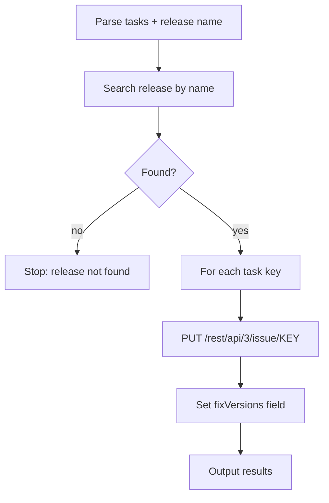

# release-add

Add Jira tasks to a release version.

## 1. Quick start

```bash
release-add PROJ-123 "API v2.1"
release-add PROJ-123 PROJ-124 PROJ-125 "Q2 Sprint"
```

## 2. Output

```text
✅ Added to release "API v2.1":
- PROJ-123 ✅
```

## 3. Setup

Same `.env.local` as other jiraflow skills. No additional config needed.

## 4. Flow



### External calls

| Source | Call type |
|---|---|
| Jira REST API | HTTP GET versions, PUT issue |

## 5. File structure

```text
skills/release-add/
  SKILL.md    ← skill description + workflow
  README.md   ← this file
```
