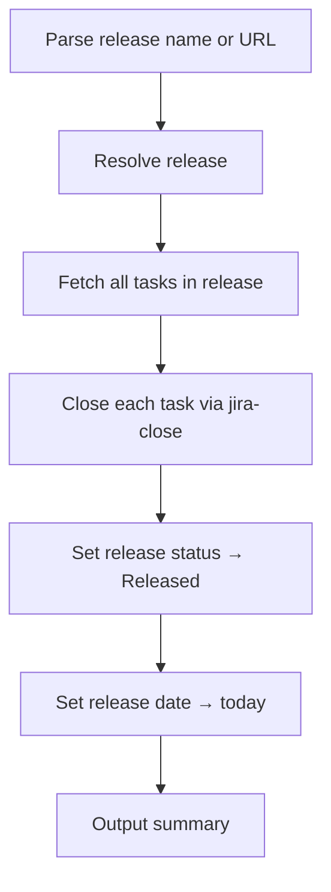

# release-complete

Finalize a Jira release — close all tasks and mark as Released.

## 1. Quick start

```bash
release-complete "API v2.1"
release-complete https://<domain>.atlassian.net/projects/PROJ/versions/12345
```

## 2. Output

```text
Closing 5 tasks from release "API v2.1"...
- PROJ-100 → Closed ✅
- PROJ-101 → Closed ✅
- PROJ-200 → Closed ✅
- PROJ-201 → Closed ✅
- PROJ-202 → Closed ✅

Release "API v2.1" → Released ✅
```

## 3. Setup

Same `.env.jira` as other jiraflow skills. Delegates task closures to `jira-close`.

## 4. Flow



### External calls

| Source | Call type |
|---|---|
| Jira REST API | HTTP GET versions, search issues, PUT version |
| `jira-close` skill | delegates task closures |

## 5. File structure

```text
skills/release-complete/
  SKILL.md    ← skill description + workflow
  README.md   ← this file
```
