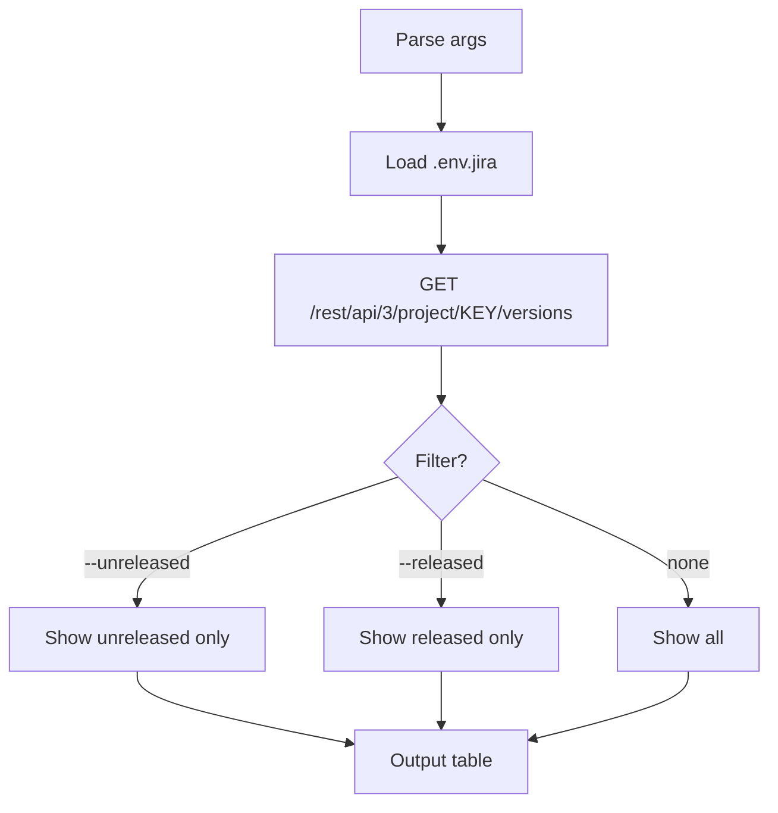

# release-list

List releases in a Jira project with optional filtering.

## 1. Quick start

```bash
release-list                 # all releases for default project
release-list --unreleased    # unreleased only
release-list --released      # released only
release-list PROJ            # specific project
```

## 2. Output

```text
# Releases — PROJ

| Name | Status | Date |
|---|---|---|
| v2.1 | Unreleased | — |
| v2.0 | Released | 2026-05-15 |
| v1.9 | Released | 2026-04-01 |
```

## 3. Setup

Same `.env.jira` as other jiraflow skills. No additional config needed.

## 4. Flow



### External calls

| Source | Call type |
|---|---|
| Jira REST API | HTTP GET versions |

## 5. File structure

```text
skills/release-list/
  SKILL.md    ← skill description + workflow
  README.md   ← this file
```
