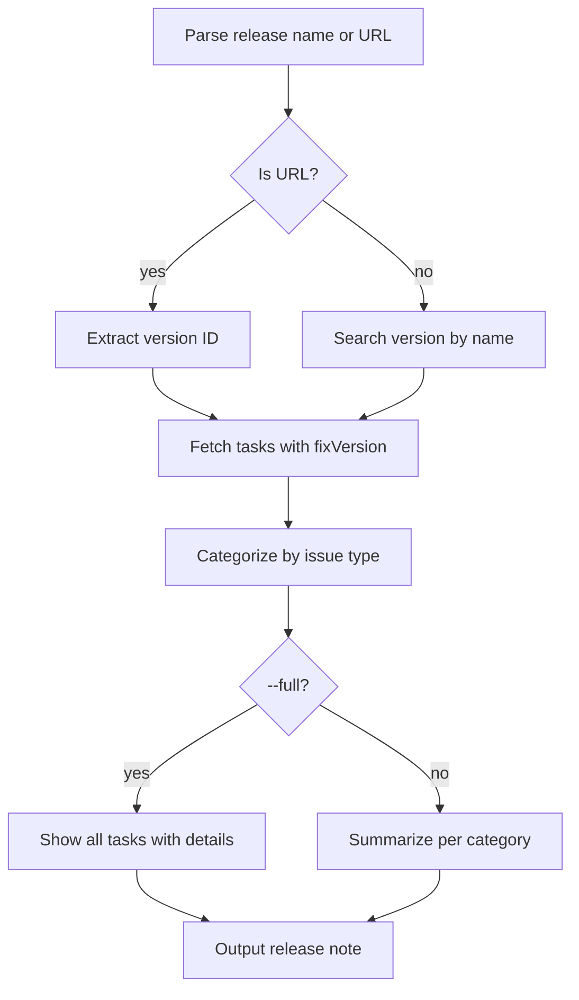

# release-note

Generate client-friendly release notes from tasks in a Jira release version.

## 1. Quick start

```bash
release-note "API next version"
release-note https://<domain>.atlassian.net/projects/PROJ/versions/12345
release-note --full          # include all tasks, not just summaries
```

## 2. Output

```text
# Release Note — API v2.1

## Changed
- PROJ-100: Added pagination to search results
- PROJ-101: Updated authentication flow

## Fixed
- PROJ-200: Login redirect after token expiry
- PROJ-201: Duplicate LT number generation
```

## 3. Setup

Same `.env.jira` as other jiraflow skills. No additional config needed.

## 4. Flow



### External calls

| Source | Call type |
|---|---|
| Jira REST API | HTTP GET versions, search issues |

## 5. File structure

```text
skills/release-note/
  SKILL.md    ← skill description + workflow
  README.md   ← this file
```
