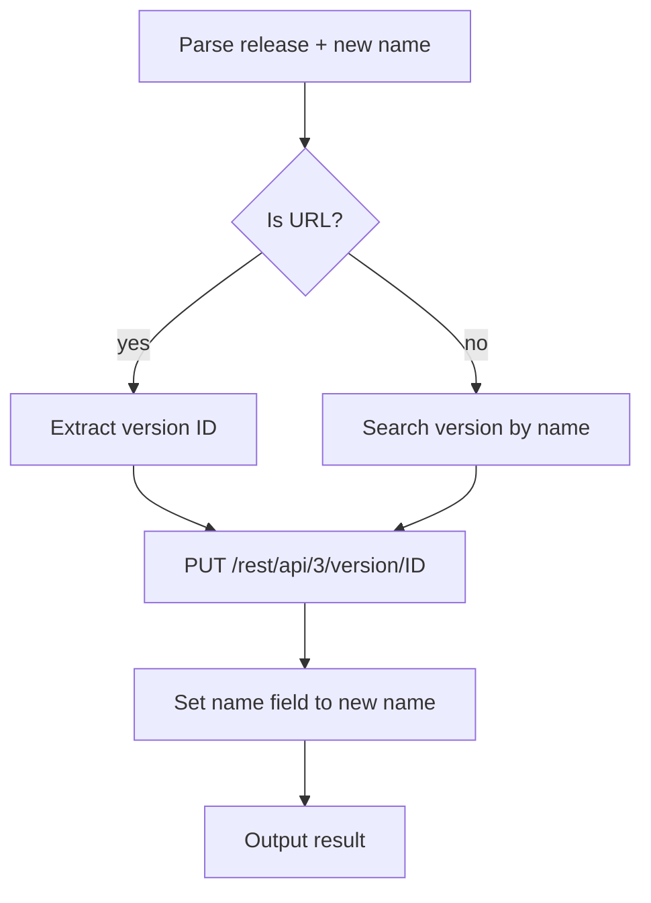

# release-rename

Update the name of a Jira release version.

## 1. Quick start

```bash
release-rename "API v2.1" "API v2.2"
release-rename https://<domain>.atlassian.net/projects/PROJ/versions/12345 "New Name"
```

## 2. Output

```text
✅ Release "API v2.1" → "API v2.2"
```

## 3. Setup

Same `.env.local` as other jiraflow skills. No additional config needed.

## 4. Flow



### External calls

| Source | Call type |
|---|---|
| Jira REST API | HTTP GET versions, PUT version |

## 5. File structure

```text
skills/release-rename/
  SKILL.md    ← skill description + workflow
  README.md   ← this file
```
