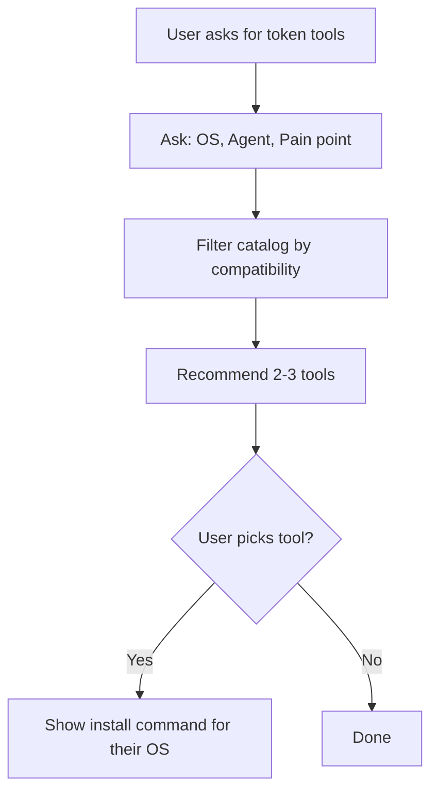

# Token Tools

Help developers choose and install token-saving tools for their coding agent.

## Agent support matrix

| Tool | Claude Code | Cursor | Copilot | Gemini CLI | Zed | Windsurf | OpenCode |
|------|:---:|:---:|:---:|:---:|:---:|:---:|:---:|
| [RTK](https://github.com/rtk-ai/rtk) | ✅ | ✅ | ✅ | ✅ | ❌ | ✅ | ❌ |
| [Caveman](https://github.com/juliusbrussee/caveman) | ✅ | ✅ | ✅ | ✅ | ✅ | ✅ | ✅ |
| [codebase-memory-mcp](https://github.com/DeusData/codebase-memory-mcp) | ✅ | ❌ | ❌ | ✅ | ✅ | ❌ | ✅ |
| [claude-mem](https://github.com/thedotmack/claude-mem) | ✅ | ❌ | ❌ | ✅ | ❌ | ❌ | ✅ |

## Tool guidelines

### RTK — transparent CLI proxy

- **Best for:** Anyone on Claude Code or Cursor. Install first — biggest impact.
- **How it works:** Intercepts shell commands (`git diff`, test output) and compresses them before the LLM sees them.
- **Token savings:** 60-90% on shell-heavy workflows.
- **Install:** `brew install rtk`
- **Limitation:** Does not work with Zed.

### Caveman — response style compression

- **Best for:** Everyone. Works with any agent, including Zed.
- **How it works:** Changes the LLM's response style — drops filler words, articles, pleasantries. Keeps technical accuracy.
- **Token savings:** ~75% on LLM output.
- **Install:** Already available in devflow. Say `caveman` to activate.
- **Limitation:** Only cuts output tokens, not input.

### codebase-memory-mcp — code knowledge graph

- **Best for:** Large repos where the agent re-reads full files repeatedly.
- **How it works:** Indexes your codebase into a graph. Agent queries symbols, call chains, and ADRs instead of reading full files.
- **Token savings:** Significant (avoids repeated full-file reads).
- **Install:** `curl -fsSL https://raw.githubusercontent.com/DeusData/codebase-memory-mcp/main/install.sh | bash`
- **Limitation:** Requires MCP support. macOS/Linux only. Initial indexing takes time.

### claude-mem — persistent session memory

- **Best for:** Long-running sessions where you want the agent to remember past conversations.
- **How it works:** Stores context externally via MCP. Filters and retrieves only relevant memories before sending to LLM.
- **Token savings:** Significant (no re-loading full context each session).
- **Install:** `npx claude-mem install`
- **Limitation:** Requires MCP. Does not work with Zed.

## Quick decision guide

| Your setup | Install |
|-------------|---------|
| Claude Code / Cursor | RTK + Caveman |
| Zed | Caveman + codebase-memory-mcp |
| Gemini CLI | RTK + claude-mem |
| Any agent, want simplest | Caveman only |

## Files

| File | Purpose |
|------|---------|
| `SKILL.md` | Skill instructions (3-step workflow) |
| `token-tools-data.md` | Full tool catalog with install commands |
| `README.md` | This file — guidelines + matrix |
