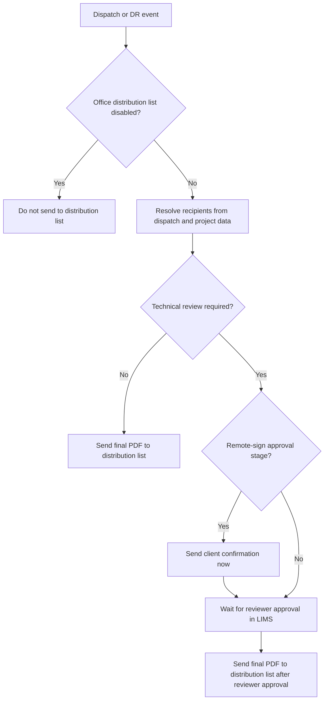

# Distribution List

> Focused summary of distribution-list behavior inferred from email-related Jira tasks. Use this as working memory, not a source of truth.

## 1. What "distribution list" means here

In this task corpus, the distribution list is the set of project/report recipients who should receive a final DR/report email, usually with a PDF attached or linked.

Common related fields/terms seen in tasks:

- `CustomerEmails`
- project distribution list
- report distribution
- technical reviewer distribution list
- `ProjectCustomTabFields`

The distribution list appears to be data-driven and often tied to project number + scope, with some differences between legacy and newer app flows. [🟢 8/10]

## 2. High-level behavior

Distribution-list delivery depends on workflow state, app path, and office/project configuration.

The strongest recurring rules are:

1. A final report/dispatch file should often be sent to the distribution list.
2. Technical-review state can delay or alter when the distribution list is emailed.
3. Some offices can disable distribution-list behavior entirely.
4. Legacy iPad and newer Field App do not always build recipients the same way.
5. Bad underlying data can make the wrong emails appear in the list.

## 3. Core workflow rules

### Distribution-list workflow map

## 3.1 Standard dispatch/report expectation

From tasks like `RMASUP-1503`, `RMASUP-1648`, `RMASUP-170`, `RMASUP-1982`:

Expected pattern:

1. Dispatch/DR is submitted or reaches a final/logged-out state.
2. System resolves the distribution list for that report/project.
3. Final PDF/report file is sent to the distribution list.

This is the default business expectation seen across many issues. [🟢 8/10]

## 3.2 Technical review affects timing

This is one of the most important rules.

From `RMASUP-1503`, `RMASUP-1982`, and task references to `RMASUP-1338`:

- If a dispatch is in technical-review flow, distribution-list delivery may happen only **after reviewer approval**.
- Missing logic in the technical-review approval handler caused real bugs where the distribution list was never emailed even though other handlers worked.
- Production verification later confirmed that in technical-review flow, the email with the full PDF is sent to the distribution list when the reviewer approves the dispatch.

### Practical rule

If a DR requires technical review, do not assume the distribution list is emailed at initial submit time. The send may be deferred to the reviewer-approval stage. [🟢 9/10]

## 3.3 Remote signature branch

From `RMASUP-1982`:

### Original bug

- After remote-signature approval, only the remote-signing client received the confirmation email.
- The full distribution list did not receive the signed report.

### Intended logic

1. If DR is accepted and **not** in technical review:
   - send to the distribution list after remote-sign approval.
2. If DR is accepted and **in** technical review:
   - keep technical-review gating logic
   - client still receives approval-stage email
   - distribution list send may wait for reviewer approval in LIMS.

### Important nuance

Task comments temporarily showed conflicting behavior during QA, but the intended rule remained: technical review should continue to control final distribution-list timing. [🟢 8/10]

## 4. Where the list comes from

## 4.1 Project-driven list data

From `RMASUP-1259`:

- Legacy iPad submission can derive the distribution list based on the dispatch's **project number and scope**.
- In that case, extra recipient emails were found in the list because they existed in project-related data.
- Those extra addresses were traced to `ProjectCustomTabFields` / customer-email data and later cleaned up.

This strongly suggests the distribution list is at least partly sourced from project metadata rather than only from a transient UI-entered list. [🟢 8/10]

## 4.2 CustomerEmails

From `RMASUP-1503` and `RMASUP-1259`:

- Some dispatches were missing `CustomerEmails`, which caused expected inboxes not to receive anything.
- Legacy paths may expand recipients using project-number/scope logic and project custom-tab data.

### Practical takeaway

If distribution-list email is wrong or missing, inspect both:

- dispatch-level customer email fields
- project-level custom-tab / source data used to build the list

## 5. Per-office disabling

From `RMASUP-1049`:

Distribution-list usage can be disabled per office.

Observed behavior:

- There is a `Disable Distribution List` setting per office.
- Dispatch always has an office, so office-level disabling was considered sufficient.
- Field App messaging had to change because the app still said "sent to the distribution list" even when the office setting disabled that behavior.

### Important implications

If an office has distribution list disabled:

- backend should not send to the list
- frontend/mobile confirmation text should not imply that it did

This is both a business rule and a UX consistency rule. [🟢 9/10]

## 6. Legacy iPad vs Field App differences

From `RMASUP-1259` and `RMASUP-1648`:

### Legacy iPad behavior

- Legacy iPad submission may derive recipients from project number and scope.
- This can produce more recipients than users expect if project custom data contains extra emails.
- A regression was reported where legacy iPad stopped sending to the distribution list after an update.
- Later QA notes said legacy workflow should send the dispatch file to the distribution list as well.

### Field App behavior

- Field App behavior is treated as the target/expected behavior in multiple tasks.
- In at least one task comment, Field App was described as sending files to `CustomerEmails` only, while legacy could expand via project/scope lookup.

### Best inference

The two app families do not always use the exact same recipient-resolution path. [🟡 6/10]

That difference is important when debugging "extra recipients", "missing recipients", or "works in Field App but not legacy" reports.

## 7. Technical reviewer vs distribution list

Several tasks distinguish these audiences.

Relevant tasks:

- `RMASUP-1074` — turn off reviewer notification email
- `RMASUP-1338` — technical reviewer distribution list
- `RMASUP-1982` — remote signature + distribution list logic

### Key distinction

- Technical reviewer notification email is not the same thing as final distribution-list delivery.
- Reviewer emails can be disabled while distribution-list sending remains part of final-report flow.
- Transitioning to `PendingTechnicalReview` should not necessarily email the technician/reviewer audience.

### Practical debugging rule

Always ask which email failed:

- reviewer notification?
- client confirmation?
- final PDF to distribution list?

Those are separate branches. [🟢 8/10]

## 8. Common failure modes

## 8.1 List not populated

Seen in titles like:

- `RMASUP-2122` — distribution list did not populate
- `RMASUP-430` — customer emails are not populated from LIMS

Likely causes:

- missing source data in project/LIMS
- bad sync from source systems
- app-specific resolution differences

## 8.2 List exists but no email sent

Seen clearly in `RMASUP-1503` and `RMASUP-2070`.

Possible causes:

- missing send logic in a workflow branch
- especially technical-review approval path not handled
- dispatch had recipients but final handler never sent

## 8.3 Wrong recipients / too many recipients

Seen in `RMASUP-1259`.

Cause:

- project-level source data included redundant email addresses
- legacy app expanded recipients from project/scope-derived list

Fix used:

- clean up redundant emails in `ProjectCustomTabField` data on UAT/PROD

## 8.4 Duplicate emails

Seen in titles like:

- `RMASUP-1902` — Email sent to Distribution list multiple times
- `RMASUP-2` — remote signature duplicate emails

Likely areas to inspect:

- multiple workflow handlers firing
- remote-sign + review approval overlap
- differences between app trigger and backend finalization

## 8.5 UX says list was used but it was not

Seen in `RMASUP-1049`.

Cause:

- Field App hard-coded success text implied list send even when office disabled it

Fix direction:

- API should return the flag/state so UI messaging matches backend behavior

## 9. Confirmed scenario matrix

Based on `RMASUP-1049`, `RMASUP-1503`, `RMASUP-1648`, and `RMASUP-1982`:

| Scenario | Expected distribution-list behavior |
|----------|-------------------------------------|
| Office has distribution list disabled | Do not send to distribution list |
| DR accepted, no technical review | Send to distribution list |
| DR in technical review flow | Send may wait until reviewer approval |
| Remote sign, no technical review | Send to distribution list after remote-sign approval |
| Remote sign + technical review | Client may get approval-stage email; distribution list may wait for reviewer approval |
| Legacy iPad submission | Distribution list may be resolved via project number + scope |
| Field App submission | Expected to send to configured customer/distribution recipients, but may differ from legacy resolution logic |

## 10. Representative tasks and what they teach

| Task | What it teaches |
|------|-----------------|
| `RMASUP-1982` | Best concrete rule set for remote-signature and technical-review interaction |
| `RMASUP-1503` | Best example of missing distribution-list send logic in one workflow branch |
| `RMASUP-1049` | Office-level disable flag and UI/backend consistency |
| `RMASUP-1259` | Legacy iPad recipient derivation and project-data cleanup |
| `RMASUP-1648` | Legacy app should still send to distribution list after updates |
| `RMASUP-1074` | Reviewer notifications are separate from distribution-list delivery |

## 11. Debugging checklist

When a user says "distribution list email failed", check in this order:

1. **Was distribution list disabled for the office?**
2. **Was the dispatch in technical review?**
3. **Which step should have sent the email?**
   - submit
   - remote-sign approval
   - reviewer approval
   - log out
4. **Did the dispatch actually have `CustomerEmails`?**
5. **Did project-level source data add or omit recipients?**
6. **Was this Legacy iPad or Field App?**
7. **Was the wrong email missing?**
   - client
   - reviewer
   - distribution list
8. **Did a workflow handler omit the distribution-list send branch?**
9. **Were duplicate or stale project-custom emails inflating the recipient list?**

## 12. Practical guidance

If you work on this area, assume:

- distribution-list sending is not a single universal branch
- technical review changes delivery timing
- office config can suppress sending entirely
- legacy and Field App may resolve recipients differently
- project/source data quality directly affects who gets emailed
- reviewer notifications and distribution-list delivery must be treated as separate concerns

## 13. Confidence / open questions

Confirmed with strongest evidence:

- office-level disable exists [🟢 9/10]
- technical review changes when the list is emailed [🟢 9/10]
- remote-sign flow had explicit distribution-list rules [🟢 9/10]
- legacy app can derive recipients from project number + scope [🟢 8/10]
- project custom data can inject redundant recipients [🟢 8/10]

Still uncertain:

- exact current unified algorithm for recipient resolution across all apps [🟡 6/10]
- exact current usage of `CustomerEmails` across different app/code paths [🟡 6/10]
- whether Field App now fully matches legacy behavior or intentionally differs [🟡 5/10]
