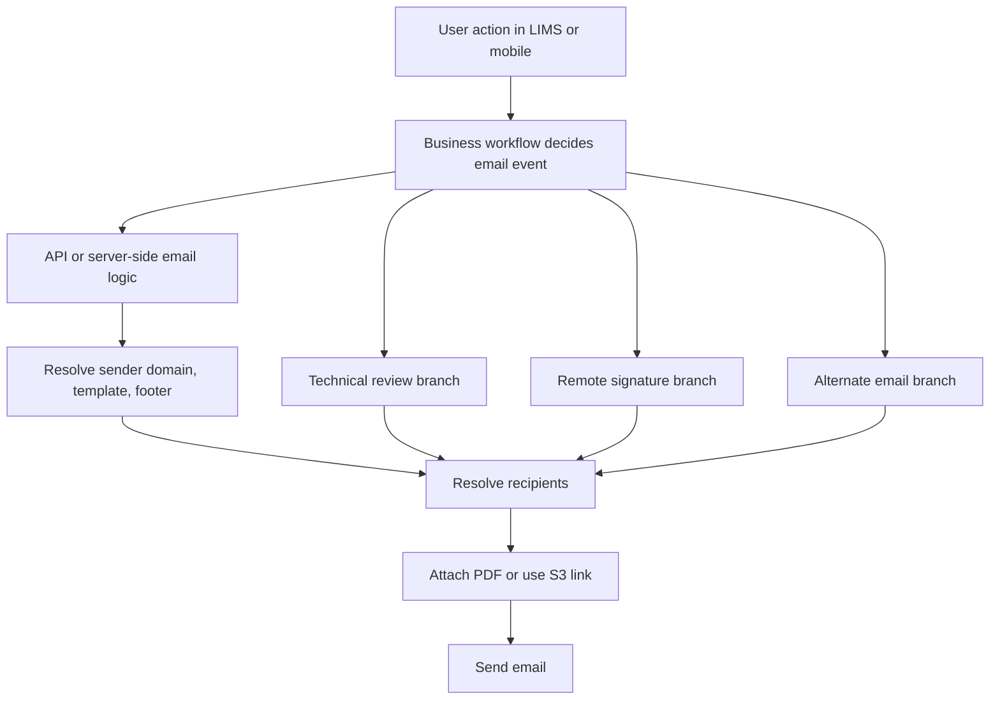

# Emailing

> Summary of email-related behavior inferred from Jira task history. Use this as working memory, not a source of truth.

## 1. Overview

Email behavior in this product spans several areas:

- `LIMS` legacy/desktop workflows
- `Dispatch API` / `Auth API` server-side email sending
- `iPad` / `Tablet` / `Field App` flows
- report/distribution-list notifications
- remote-signature approval emails
- background processes that read or generate email-driven artifacts
- multi-domain sender support

Task history shows a gradual move away from client-side or scattered email logic toward centralized server-side email handling via API endpoints. [🟢 9/10]

## 2. Main architectural pattern

### 2.1 Centralized email sending via API

Strongly suggested by tasks such as:

- `RMASUP-248` — API - Create email API
- `RMASUP-1702` — Legacy API - Setup new legacy APIs to call Auth email API
- `RMASUP-1901` — LIMS - Update legacy API to support multiple email domains
- `RMASUP-2009` — Budget Website - Support Multiple Email Domains

Observed pattern:

1. Frontend/mobile/legacy systems trigger a server-side action.
2. API layer decides what email to send.
3. Server-side email logic sends the message, sometimes with attachments.
4. Legacy systems may proxy through newer APIs instead of owning mail logic directly.

Key signal from `RMASUP-248`:

- There was explicit pushback against letting frontend send email directly.
- Preferred design: the API should perform the business action and send the email inside its own logic.

Confirmed example:

- `POST /api/emails` was introduced in `RMASUP-248`.

### Email workflow map

## 3. Email-capable systems

### 3.1 Dispatch API / Auth API

From task history, these APIs handle or increasingly centralize:

- general email sending
- DR / dispatch notifications
- distribution-list delivery
- remote-signature related email flows
- multiple sender-domain logic
- shared email-template behavior

Relevant tasks:

- `RMASUP-248`
- `RMASUP-397`
- `RMASUP-1635`
- `RMASUP-1982`
- `RMASUP-1901`

### 3.2 LIMS / legacy APIs

LIMS still appears to own or trigger some email workflows, especially older ones:

- report distribution
- billing batch report emails
- duplicate employee notifications
- alternate email workflows
- CST / concrete report emailing

But later tasks show a preference to have legacy systems call Auth/API email logic instead of maintaining separate per-domain logic locally.

Relevant tasks:

- `RMASUP-123`
- `RMASUP-170`
- `RMASUP-1806`
- `RMASUP-1816`
- `RMASUP-1901`
- `RMASUP-1702`

### 3.3 iPad / Tablet / Field App

Task history shows many email issues tied to mobile UX and report sending:

- sending distribution-list emails
- default mail-app behavior on iOS
- server-side popup/send-from-server flows
- remote-signature approval emails
- customer CC / distribution-list handling
- email body / template behavior

Relevant tasks include:

- `RMASUP-2`
- `RMASUP-1126`
- `RMASUP-1512`
- `RMASUP-1516`
- `RMASUP-1521`
- `RMASUP-1587`
- `RMASUP-1590`
- `RMASUP-1648`
- `RMASUP-1656`
- `RMASUP-1668`
- `RMASUP-1982`

## 4. Main email workflows

### 4.1 Dispatch / DR distribution workflow

Strongly evidenced by `RMASUP-1982`, `RMASUP-170`, `RMASUP-1816`, and related titles.

Typical flow:

1. A dispatch / DR reaches a state where an email should be sent.
2. System determines recipients:
   - client
   - distribution list
   - sometimes technical reviewer
3. System generates or attaches the PDF/report.
4. Email is sent from server-side logic.
5. Behavior depends on project settings and technical-review state.

#### Remote signature branch

From `RMASUP-1982`:

- If DR is accepted and **not** in technical review, email should go to the distribution list.
- If DR is accepted and **is** in technical review, behavior is split:
  - client still receives confirmation at the approval stage
  - distribution list may wait until reviewer approval in LIMS
- The task history shows this logic was refined during QA because early implementation sent to the wrong audience.

### 4.2 Cancel / reschedule email workflow

Inferred from `RMASUP-248`:

1. User initiates cancel/reschedule action.
2. Instead of frontend directly sending an email, API should expose a business endpoint.
3. API updates DB/business state.
4. API sends the email as part of the action.

This is an important design signal: email should be a side effect of business operations, not a raw frontend mail action. [🟢 8/10]

### 4.3 Alternate Email workflow

From `RMASUP-1795` and related tasks like `RMASUP-1721`:

- LIMS already has a feature that sends a prefilled PDF email to a client.
- Prefilled fields include values like:
  - DR number
  - project number
  - scope
- Client wanted a similar capability in Salesforce-related workflows to send those prefilled PDFs to vendors.

The full implementation details were not confirmed, but the concept appears to be:

1. generate or identify a PDF
2. prefill report metadata
3. send to an alternate/non-default recipient path

### 4.4 Incoming email / reader workflows

Task titles suggest there is also an email-reading side of the system:

- `RMASUP-1358` — Investigate email reading process
- `RMASUP-1887` — LIMS - Update email reader app
- `RMASUP-1935` — devops - Setup an incoming email so that we can create task via this email

And `RMASUP-1652` explicitly mentions background-app mailboxes used by a background app that reads PDF attachments.

That suggests at least one email ingestion workflow exists for attachment processing or automation. [🟡 6/10]

## 5. Templates and branding

Template/branding behavior is clearly important.

Relevant tasks:

- `RMASUP-1084` — API - Update email templates
- `RMASUP-1324` — API - Email templates update for Field App
- `RMASUP-1861` — API - Update email template for DR
- `RMASUP-2038` — API - Remove 'Revision Notes' from revision email template
- `RMASUP-1366` — Admin - API - Add email footer for office
- `RMASUP-1637` — API - Get office's email footer
- `RMASUP-1919` — [API] The logo is not included in the email footer.
- `RMASUP-254` — API - Custom email footers
- `RMASUP-1599` — LIMS - Update to use email footer in Office entity in admin portal

### Observed template concerns

- office-specific email footers
- footer logos
- revision-note content
- title/subject updates
- Field App-specific templates
- template consistency between systems

### Footers

The task corpus strongly suggests footer behavior is office-aware and admin-configurable. [🟢 8/10]

The likely model is:

1. office entity holds footer/domain-related settings
2. API fetches office footer
3. outgoing emails render footer/branding accordingly

## 6. Attachments and payloads

Email messages can include attachments or links.

Observed signals:

- `RMASUP-248`: added ability to send a file attachment via email API
- `RMASUP-1313`: send S3 link instead of attaching full PDF
- `RMASUP-1982`: signed report PDF delivery to client/distribution list
- `RMASUP-1795`: prefilled PDFs in alternate email workflow

Likely supported payload patterns:

- file attachments
- report PDFs
- S3-hosted document links instead of large attachments

## 7. Multiple email domains

This is one of the clearest email architecture themes.

Primary tasks:

- `RMASUP-1652` — Multiple email domains
- `RMASUP-1901` — LIMS - Update legacy API to support multiple email domains
- `RMASUP-2009` — Budget Website - Support Multiple Email Domains
- `RMASUP-1638` — API - Update to use Ceterra email addresses
- `RMASUP-1653` — Admin - Add Email Domain dropdown list to office entity
- `RMASUP-1923` — A DR is at an office but receives emails from a different email domain

### Confirmed domain set from `RMASUP-1652`

Task history says the application needed to support sending from at least these domains:

- `certerra.com`
- `certerra-rmagroup.com`
- `certerra-subsurface.com`

### Important operational notes from task history

- old addresses were kept as aliases, so there was no downtime
- SendGrid key display names changed, but values stayed the same
- a new Azure OAuth app was created for Certerra tenant
- Azure client secret expires in 24 months and must be rotated
- background app mailboxes exist for dev/UAT/prod attachment-reading flows

### Confirmed mailbox examples from `RMASUP-1652`

The tasks include examples like:

- `reports@certerra.com`
- `reports-uat@certerra.com`
- `reports-dev@certerra.com`
- equivalent mailboxes for `certerra-rmagroup.com`
- equivalent mailboxes for `certerra-subsurface.com`
- `appdr-dev@certerra.com`
- `appdr-uat@certerra.com`
- `appdr@certerra.com`
- `compliance-uat@certerra.com`
- `compliance@certerra.com`

## 8. Delivery providers / auth mechanisms

### 8.1 SendGrid

Strongly suggested by:

- `RMASUP-1135` — SendGrid email issue
- `RMASUP-1652` comments about SendGrid API key renaming

### 8.2 Azure / Microsoft 365 shared mailboxes

Strongly suggested by `RMASUP-1652`:

- Microsoft 365 shared mailboxes are in use
- Azure OAuth app registration is used
- multiple tenants/mailboxes exist
- background app reads attachments from mailboxes

### 8.3 Mixed provider model

Best current inference:

- system likely uses both mailbox/OAuth-based infrastructure and provider-based sending concerns (e.g. SendGrid), depending on subsystem or migration stage. [🟡 6/10]

## 9. Known email use cases from tasks

Observed or strongly implied use cases:

- dispatch review email
- customer notification email
- duplicated employee code/admin notification email
- billing batch report email
- remote signature client confirmation email
- distribution list final-PDF email
- CST / concrete report email
- job site report email
- password reset email
- error report email list
- revision email template
- alternate email with prefilled PDF

From `RMASUP-1901`, specifically confirmed legacy/LIMS-related categories include:

- Dispatch Review Email
- Start Customer Email Notification
- Duplicated Employee Email
- Billing batch report email

## 10. Common problems and quirks

Task history shows emailing is a high-friction area. Repeated problem patterns include:

### 10.1 Wrong recipients

Examples:

- only client gets remote-sign approval email instead of distribution list
- wrong distribution list behavior
- duplicate emails
- delayed emails
- missing recipients
- office gets email from wrong domain

### 10.2 Template / formatting issues

Examples:

- missing footer logo
- wrong footer/domain
- subject/title changes needed
- revision notes in wrong template
- incomplete or inconsistent branding

### 10.3 Environment / domain issues

Examples:

- dev email sending failures
- multiple-domain rollout
- legacy APIs not aligned with new domain logic
- cross-app inconsistencies between API, LIMS, Budget app, iPad/Field App

### 10.4 Client-side app issues

Examples:

- iPad cannot send email
- iOS mail-app behavior changed
- popup/send-from-server redesign needed
- distribution-list delivery not matching desktop behavior

## 11. Product/design guidance inferred from tasks

These are strong recurring design preferences from the task corpus:

### 11.1 Prefer server-side sending

Do not rely on frontend or mobile app to compose/send critical business emails directly.

### 11.2 Tie emails to business events

Emails should be sent as part of domain actions such as:

- dispatch approval
- report generation
- duplicate-employee detection
- cancel/reschedule
- billing batch processing

### 11.3 Centralize sender-domain logic

Domain selection should be shared across applications and likely driven by office/environment/domain configuration.

### 11.4 Keep legacy integrations thin

Where possible, legacy systems should call shared email APIs rather than reimplementing domain-specific or template-specific logic.

## 12. Representative tasks to read first

If you need to understand emailing quickly, start with these:

| Task | Why read it |
|------|-------------|
| `RMASUP-248` | Earliest clear server-side email API decision |
| `RMASUP-1982` | Best concrete example of recipient logic for remote-signature + distribution list |
| `RMASUP-1901` | Strong overview of multiple domains and legacy-to-Auth-API transition |
| `RMASUP-1652` | Best operational overview of multi-domain mailbox/OAuth setup |
| `RMASUP-1795` | Alternate email / prefilled PDF feature concept |
| `RMASUP-254` | Custom footer/branding direction |
| `RMASUP-2009` | Shows multi-domain logic spreading into other apps |

## 13. Open questions

These were not fully confirmed from the sampled tasks:

- exact schema/config source for choosing sender domain per office/environment [🟡 6/10]
- precise provider split between SendGrid and Azure/M365 [🟡 5/10]
- whether all modern apps now route through Auth API or only some of them [🟡 6/10]
- exact endpoint inventory beyond `POST /api/emails` [🟡 5/10]
- current implementation of alternate-email PDF flow [🟡 4/10]

## 14. Practical takeaway

If you work on email-related tasks in this ecosystem, assume:

- recipient logic is workflow-sensitive
- technical-review state affects who gets emailed and when
- office/domain configuration matters
- legacy and new systems may both participate
- server-side centralized email APIs are preferred
- branding/footer/domain consistency is a recurring source of bugs
