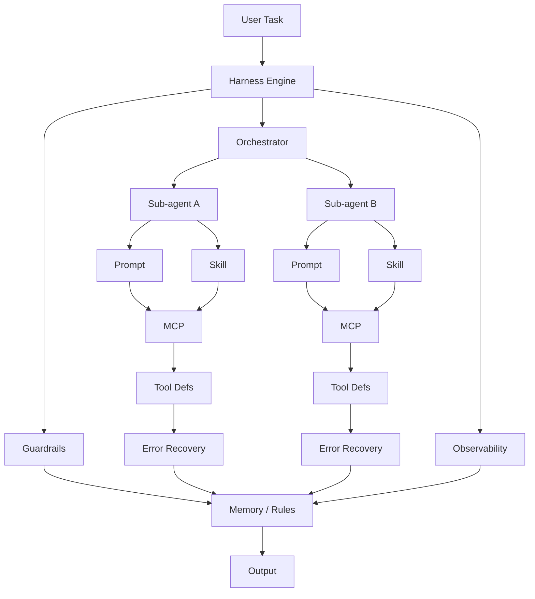

# AI Coding Concepts for Local Dev

## Slide 1 — Title
- AI Coding Concepts for Local Dev.
- Prompts, rules, skills, agents, tools, context, and memory.

## Slide 2 — Why this matters
- Same repo, different AI setups, different results.
- Shared setup makes output more consistent.
- Goal: less guesswork, better team workflow.

## Slide 3 — Big picture
- Prompt tells the AI what to do.
- Context gives the AI what it can see now.
- Memory keeps what should survive later.
- Rules constrain behavior.
- Skills package repeatable workflows.
- Plugins automate real actions.
- Agent combines them into execution.

## Slide 4 — LLM concept
- LLM = language model that predicts the next tokens.
- Good at drafting, explaining, transforming, and summarizing.
- Not a source of truth.
- Must be checked with real files, tests, and outputs.

## Slide 5 — Tokens and context
- Token = chunk of text, not exactly a word.
- Context window = how much the model can use now.
- Prompt, files, tool output, chat history all consume context.
- Bigger context helps, but too much noise hurts.

## Slide 6 — Session concept
- Session = the current working conversation.
- It includes prompts, replies, tool calls, and temporary state.
- Session is larger than the context sent on one turn.
- Session is often temporary.

## Slide 7 — Diagram
```text
Prompt + files + rules + memory + tool output
                    |
                    v
                 Tokens
                    |
                    v
            Current context window
                    |
                    v
                   LLM
                    |
                    v
        Response + tool actions + new state
                    |
                    v
              Working session
```
- Session is the workspace.
- Context is the slice sent now.

## Slide 8 — Session limits
- Session may be lost next time.
- Long sessions get noisy.
- Important decisions can disappear in chat.
- Write key state to repo files.

## Slide 9 — Memory concept
- Memory = stored information reused later.
- Short-term memory = current session and context.
- Long-term memory = external storage around the model.
- Common team pattern: Markdown memory files.

## Slide 10 — File-based memory
- Pros: simple, visible, versioned, cross-tool.
- Pros: easy for humans and LLMs to read.
- Cons: can get stale, noisy, duplicated.
- Cons: large files reduce relevance.
- Keep memory small and curated.

## Slide 11 — Context rot
- Quality drops when context gets too long or noisy.
- Model may forget earlier constraints.
- More context is not always better.
- Use fresh sessions and task-focused context.

## Slide 12 — Hallucinations
- AI can invent files, APIs, facts, or behavior.
- Confident tone does not mean correct output.
- Hallucinations increase with vague or noisy context.
- Verify with code, tests, grep, and build output.

## Slide 13 — Other failure modes
- Omission: skips an important step or requirement.
- Instruction drift: starts right, then ignores earlier constraints.
- Overconfidence: sounds certain when it should be uncertain.
- Tool misuse: picks the wrong tool or wrong parameters.
- Goal drift: starts solving a different problem.
- False completion: says done before the real task is complete.

## Slide 14 — Prompt concept
- Prompt = instruction package for this task.
- Can include goal, context, constraints, format, examples.
- Good prompts reduce ambiguity.
- Structure matters more than length.

## Slide 15 — Prompt usage example
- Bug fix: describe symptom, file, expected behavior, ask for minimal change + test.
- Refactor: state goal, files in scope, keep behavior, list tests to keep passing.


## Slide 16 — Big prompt example
```text
Create a cinematic hero image for an internal engineering presentation.
Subject: senior engineer, 3 monitors, code, Git graph, AI panel.
Style: modern editorial, detailed, professional.
Scene: night office, blue-teal glow, practical desk setup.
Composition: 16:9, subject left, empty space right for title.
Constraints: no logo, no broken hands, no extra fingers.
Intent: trustworthy, practical, team presentation cover.
```
- Big prompt is fine when every section adds signal.

## Slide 17 — Prompt - PROS
- Fastest way to steer output.
- Easy to change per task.
- Can encode structure and format.
- Works across tools.

## Slide 18 — Prompt - CONS
- Vague prompt, vague result.
- Too many scripts and templates reduce focus.
- Hard to debug when huge.
- Easy to forget constraints over time.

## Slide 19 — Skill concept
- Skill = reusable workflow for a repeated job.
- Can include instructions, examples, scripts, references.
- Good for review, refactor, bug fix, docs, test generation.
- Load only when relevant.

## Slide 20 — Skill usage example
- Have a /review-skill for PR review, used on every PR.
- Have a /refactor-skill for legacy cleanup tasks.


## Slide 21 — Skill - PROS
- Reusable.
- Faster.
- More consistent.
- Captures team know-how.

## Slide 22 — Skill - CONS
- Overlap causes confusion.
- Old skills become outdated.
- Too many skills are hard to discover.
- Needs pruning.

---

## Slide 23 — Prompt vs Skill comparison

| Aspect | Prompt | Skill |
|---|---|---|
| Scope | One task | Repeated job |
| Lifetime | Temporary, inline | Persistent, reusable |
| Complexity | Short to medium | Can include scripts, examples, refs |
| Sharing | Copy-paste | File in repo, versioned |
| Discovery | Hard to find old prompts | Named file, easy to load |
| Overhead | None | Must be written and maintained |
| Runs on | Local or web — depends on AI host | Local — file in repo |
| Uses local scripts or assets | No | Yes — can reference scripts, templates, images |
| Best for | One-off asks, quick steer | Repeated workflows (review, refactor, docs) |

## Slide 24 — When to use prompt vs skill

- Use a prompt when:
  - Task is one-off.
  - Instruction is short.
  - No reuse expected.
- Use a skill when:
  - Task repeats across sessions.
  - Workflow has multiple steps.
  - Team needs consistency.
  - Worth the maintenance cost.

---

## Slide 25 — Plugin concept
- Plugin = packaged tool that the AI can invoke to perform real actions.
- Runs scripts, calls APIs, modifies files, executes commands.
- More powerful than a skill — has side effects beyond text.
- Lives in the repo as a folder with instructions, scripts, and config.
- The harness loads plugins and exposes their tools to the AI.

## Slide 26 — Plugin usage example
- `devflow` plugin: commit code, push branches, create PRs, resolve comments.
- `md-to-html` plugin: convert Markdown to styled HTML with one command.
- `db-migration` plugin: generate, validate, and apply database migrations.
- `deploy-check` plugin: run pre-deploy checks and report readiness.

## Slide 27 — Plugin - PROS
- Automates real dev workflows — not just text generation.
- Runs locally with full access to the dev machine.
- Versioned in the repo — team runs the same tools.
- Composable — plugins can call other plugins.

## Slide 28 — Plugin - CONS
- Higher risk — can mutate files, push code, trigger deployments.
- More complex to build and maintain than a skill.
- Platform-dependent — may need Python, Node, or shell.
- Needs careful permission design and guardrails.

---

## Slide 29 — Skill vs Plugin comparison

| Aspect | Skill | Plugin |
|---|---|---|
| What it is | Reusable instruction workflow | Packaged tool with actions |
| Runs | Read and followed by LLM | Can run scripts, call APIs, modify files |
| Scope | Guidance + examples | Execution + side effects |
| Risk | Low — only text | Higher — can run code and mutate state |
| Example | `/review-pr` skill | `devflow` plugin with commit, push, PR |
| Runs on | Local — file in repo | Local — on developer machine |
| Uses local scripts or assets | Can reference them | Can execute them directly |
| Best for | Consistent process, team know-how | Automating real dev actions |

## Slide 30 — When to use skill vs plugin

- Use a skill when:
  - You need a repeatable guide.
  - No code execution needed.
  - Safe to share as markdown.
- Use a plugin when:
  - You need to run scripts or tools.
  - Workflow has side effects (commit, deploy).
  - Worth the added complexity and risk.

---

## Slide 31 — Rule concept
- Rule = instruction that should apply across many tasks.
- Covers safety, coding style, architecture, review limits.
- Rules reduce repeated prompting.
- Rules define what AI must always do or avoid.

## Slide 32 — Rule usage example
- CLAUDE.md: always run tests before saying task is done.
- AGENTS.md: never change public APIs without explicit request.


## Slide 33 — Rule - PROS
- Consistency.
- Safety.
- Team alignment.
- Reusable across sessions and tools.

## Slide 34 — Rule - CONS
- Too many rules become noise.
- Duplicated rules can conflict.
- Hard to maintain if spread around.
- Needs clear owners.

---

## Slide 35 — Sub-agent concept
- Sub-agent = AI worker spawned by the main agent for a subtask.
- Has its own context window — does not see the main conversation.
- Receives a concrete, self-contained task from the main agent.
- Returns only its final message back.
- Main agent delegates, coordinates, and synthesizes results.

## Slide 36 — Sub-agent usage example
- Parallel: spawn 3 sub-agents to research APIs, review docs, and scan code at the same time.
- Isolation: give one sub-agent a risky refactor so it cannot touch other files.
- Review: ask a sub-agent to review your diff as a fresh pair of eyes.
- Heavy work: let a sub-agent run tests or builds while you continue planning.


## Slide 37 — Sub-agent - PROS
- Parallel execution — multiple subtasks run at once.
- Clean context — each sub-agent only sees what it needs.
- Scoped writes — no accidental changes across boundaries.
- Fresh perspective — sub-agent is not biased by chat history.
- Main agent stays focused on coordination.

## Slide 38 — Sub-agent - CONS
- Setup cost — writing a good subtask takes care.
- No shared memory — sub-agent cannot see prior decisions.
- Duplication risk — two sub-agents may redo the same work.
- Coordination overhead — main agent must merge results.
- Debugging is harder — errors are buried in sub-agent logs.

---

## Slide 39 — AI agent native support comparison

| Concept | Claude Code | GitHub Copilot | Codex CLI | Zed AI | Cursor |
|---|---|---|---|---|---|
| **Prompt** | ✅ Chat input | ✅ Chat input | ✅ Chat input | ✅ Chat input | ✅ Chat input |
| **Rule** | ✅ CLAUDE.md | ✅ `.github/instructions` | ✅ AGENTS.md | ✅ `.rules` / AGENTS.md | ✅ `.cursor/rules` |
| **Skill** | ✅ Custom slash commands | ⚠️ Instructions only | ✅ AGENTS.md sections | ✅ `.rules` file | ✅ `.cursor/rules` |
| **Plugin** | ✅ MCP servers | ❌ No MCP yet | ⚠️ Tool calling | ✅ MCP support | ⚠️ Limited |
| **Sub-agent** | ✅ `spawn_agent` | ⚠️ Agent mode only | ❌ Not available | ✅ `spawn_agent` | ❌ Not available |

## Slide 40 — Native support notes

- All agents support prompts — that is table stakes.
- Rule support varies by filename: `CLAUDE.md`, `AGENTS.md`, `.cursor/rules`, `.github/instructions`.
- Skills are most fragmented — each agent uses a different file format.
- MCP is the emerging standard for plugins — Claude Code and Zed lead here.
- Sub-agent support is the newest frontier — only Claude Code and Zed have it today.
- Cross-agent portability needs a shared format (like `AGENTS.md` + MCP).

---

## Slide 41 — Orchestration concept
- Orchestration = running multiple AI agents or sub-agents on one machine.
- One main agent spawns and coordinates many sub-agents in parallel or sequence.
- Each sub-agent works on a disjoint slice — no overlapping file writes.
- The orchestrator merges results, resolves conflicts, and decides next steps.
- Think of it like a tech lead delegating to multiple devs at once.

## Slide 42 — Orchestration usage example
- Feature build: agent A does data model, agent B does API, agent C does UI — all in parallel.
- Bug hunt: spawn 5 sub-agents to search 5 modules for root cause simultaneously.
- Code review: one sub-agent checks security, another checks style, another checks tests.
- Migration: parallel agents handle different tables or services with isolated write scopes.

## Slide 43 — Orchestration - PROS
- Massive speed-up — work that takes 10 min sequential can finish in 2 min.
- Better context usage — each agent only loads what it needs, no context bloat.
- Specialization — each sub-agent can have different skills or focus areas.
- Natural review boundary — results are isolated and easy to verify.

## Slide 44 — Orchestration - CONS
- Hard to set up — task decomposition is a skill in itself.
- Merge conflicts — sub-agents may produce incompatible outputs.
- Resource heavy — many parallel agents consume RAM, CPU, and API rate limits.
- Visibility gap — orchestrator only sees final messages, not intermediate state.
- Debugging chains — one failed sub-agent can block downstream work.

---

## Slide 45 — MCP concept
- MCP = Model Context Protocol.
- Standard way for AI to connect to external tools and data.
- Like a USB-C for AI integrations — one protocol, many devices.
- Client (AI host) ↔ MCP Server ↔ External system.
- Replaces custom per-tool integrations with one open standard.

## Slide 46 — MCP architecture
```text
AI Host (Claude, Copilot, Zed, ...)
        |
   MCP Client
        |
   MCP Protocol (JSON-RPC)
        |
   MCP Server
   /    |    \
 File  Git   API
System Repo  Service
```
- Host asks → Server acts → Result returns.
- Server runs locally or remote.
- One server can expose multiple tools.

## Slide 47 — MCP usage example
- File system server: read, write, search files with permission control.
- Git server: list branches, view diffs, create commits.
- Database server: run read-only queries, inspect schema.
- API server: fetch issues, PRs, docs from external services.

## Slide 48 — MCP - PROS
- One standard instead of N custom integrations.
- Tools are discoverable and self-describing.
- Permission model built in.
- Community servers growing fast.
- Works across multiple AI hosts.

## Slide 49 — MCP - CONS
- Still early — spec and ecosystem evolving.
- Server quality varies.
- Local servers need setup and maintenance.
- Remote servers add latency and auth complexity.
- Over-fetching data can bloat context.

---

## Slide 50 — Tool definition concept
- Tool definition = the schema that tells the AI what a tool can do.
- Written as JSON Schema or function-calling format: name, description, parameters.
- The AI reads the definition to decide when and how to use the tool.
- Bad definitions cause wrong tool calls; good ones make agents reliable.
- Harness engineers must design these carefully — they are the API contract.

## Slide 51 — Tool definition example
```json
{
  "name": "read_file",
  "description": "Read a file. Use when you need to inspect code.",
  "parameters": {
    "path": { "type": "string", "description": "Relative path" },
    "start_line": { "type": "integer", "description": "Optional start" }
  }
}
```
- Clear description, typed params, no ambiguity.
- Poor definition = agent guesses wrong tool or wrong args.

## Slide 52 — Tool definition - PROS & CONS
| PROS | CONS |
|---|---|
| Predictable tool behavior | Easy to write bad descriptions |
| Self-documenting for the AI | Schema drift vs actual implementation |
| Enables safe code generation | Extra maintenance for every tool |
| Shared across AI hosts via MCP | Overly strict schemas block valid use |

---

## Slide 53 — Guardrails concept
- Guardrails = safety rules that control what the AI can and cannot do.
- Approval gates: ask user before running destructive commands.
- Scope limits: restrict file access, network domains, or tool categories.
- Hard stops: certain actions always require explicit confirmation.
- Without guardrails, autonomous agents are too risky for production.

## Slide 54 — Guardrails usage example
- File writes outside the workspace → block or require approval.
- Git push / force push → always ask for confirmation.
- Dropping tables or running migrations → hard stop, user must approve.
- External API calls → allowlist domains, block by default.
- Shell commands with `rm -rf` or `sudo` → deny automatically.

## Slide 55 — Guardrails - PROS & CONS
| PROS | CONS |
|---|---|
| Prevents catastrophic mistakes | Too strict = agent cannot do its job |
| Builds trust for autonomous workflows | Hard to get the balance right |
| Required for CI/CD and production use | Needs ongoing tuning per project |
| Audit trail of approvals | Bypass paths create security holes |

---

## Slide 56 — Observability concept
- Observability = knowing what the agent did, when, and why.
- Logs: every tool call, its input, output, and duration.
- Traces: full agent run from task start to completion.
- Metrics: success rate, token usage, cost, latency, error count.
- Without observability, debugging a failed agent run is guesswork.

## Slide 57 — Observability usage example
- Log every tool call: `[tool:read_file] path=src/main.rs duration=120ms`.
- Trace the full run: `task=fix-bug → plan → read 3 files → edit 2 files → run tests → done`.
- Metrics dashboard: tokens consumed, cost per task, error rate per tool.
- Alert: "agent made 10 tool calls but produced 0 file edits — possible loop."

## Slide 58 — Observability - PROS & CONS
| PROS | CONS |
|---|---|
| Debug agent failures fast | Logging adds latency and storage cost |
| Spot loops, stalls, and drift | Sensitive data may leak into logs |
| Track cost and token usage | Needs integration into the harness |
| Improve prompts and tool defs with data | Metrics fatigue — too many dashboards |

---

## Slide 59 — Error recovery concept
- Error recovery = what happens when a tool call fails or returns garbage.
- Retry with backoff for transient failures (network, rate limits).
- Fallback to alternative tool or strategy when primary fails.
- Escalate to user when automatic recovery is impossible.
- Dead letter: log the failure and continue with partial results.

## Slide 60 — Error recovery usage example
- File read fails with ENOENT → agent asks user for correct path.
- API rate limit → exponential backoff, retry 3 times, then escalate.
- Test run times out → agent reports partial results, asks to re-run.
- Tool returns malformed JSON → agent retries with stricter prompt.
- Shell command exits non-zero → agent reads stderr, adjusts, retries once.

## Slide 61 — Error recovery - PROS & CONS
| PROS | CONS |
|---|---|
| Agents survive real-world failures | Retry storms amplify load |
| Better UX — fewer user interruptions | Silent fallbacks hide real bugs |
| Essential for long-running tasks | Hard to test all failure paths |
| Reduces manual babysitting | Over-recovery can mask broken tools |

---

## Slide 62 — Wiring diagram

- Harness: outer shell — guard, observe, route, recover.
- Agent: inner worker — plan, use tools, produce results.
- Everything runs through MCP for tool access.
- Memory and rules surround everything as persistent constraints.

---

## Slide 63 — Local repo setup
- `AGENTS.md` for shared agent guidance.
- `CLAUDE.md` for Claude-specific onboarding.
- `.ai/memory.md` for persistent project memory.
- `.ai/agents/` for task agents or skills.
- Keep root files short.

## Slide 64 — Team workflow
- Start with clear task prompt.
- Load only needed context.
- Use shared rules and memory.
- Run tools for evidence.
- Review diffs and tests before merge.

## Slide 65 — Team policy
- One source of truth for rules.
- Small prompts, small memory, small skills.
- Store durable knowledge in files, not chat only.
- Every AI change is review-required.
