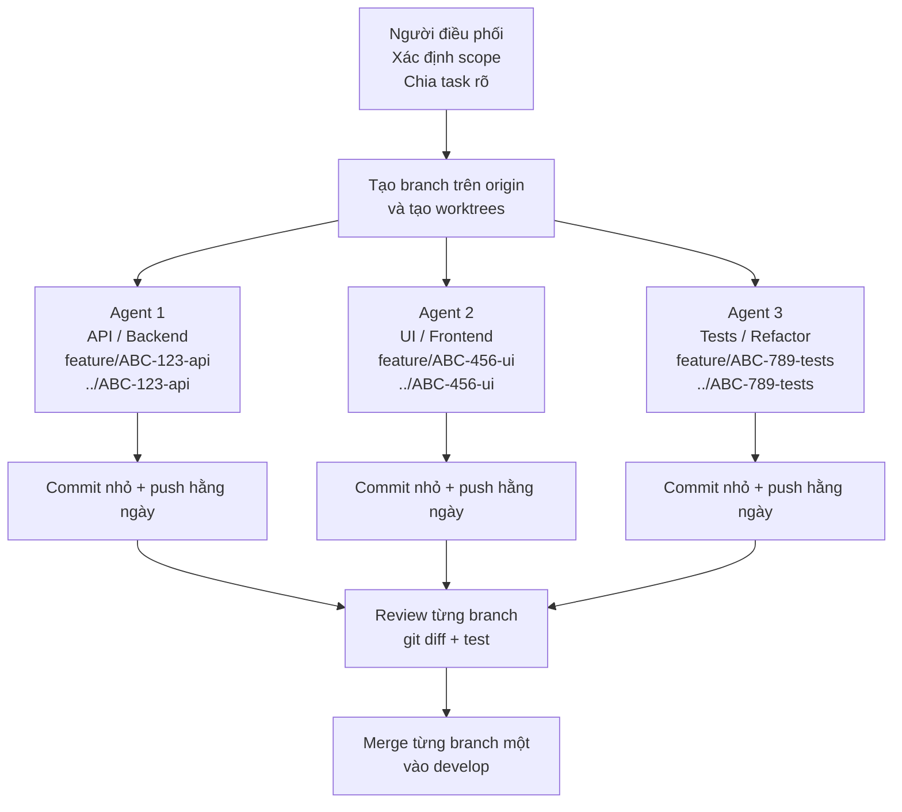

## Slide 1 — Tiêu đề

**Gitflow + Worktrees**  
**Quy trình song song, an toàn hơn cho dev và AI coding**

- Gitflow định nghĩa cấu trúc branch cho feature, release và hotfix. [docs.aws.amazon](https://docs.aws.amazon.com/prescriptive-guidance/latest/choosing-git-branch-approach/gitflow-branching-strategy.html)
- Worktree cho phép checkout nhiều branch cùng lúc ở các thư mục local khác nhau. [kernel](https://www.kernel.org/pub/software/scm/git/docs/git-worktree.html)

## Slide 2 — Vì sao cần thay đổi

**Điểm đau của workflow cũ**

- Nếu branch chỉ tồn tại local trong thời gian dài, code có thể bị mất khi máy hỏng, mất điện hoặc lỗi môi trường. [gwu-libraries.github](http://gwu-libraries.github.io/Git.html)
- Nếu đợi làm xong mới push, team khó theo dõi tiến độ và khó review sớm. [github](https://github.com/superoutput/git-best-practices)
- Khi chỉ dùng một folder local, việc chuyển task thường dẫn đến stash/checkout liên tục và dễ sai sót. [gist.github](https://gist.github.com/ashwch/946ad983977c9107db7ee9abafeb95bd)

## Slide 3 — Gitflow recap

**Gitflow giải quyết điều gì**

- `main` lưu lịch sử release chính thức, còn `develop` là branch tích hợp feature. [atlassian](https://www.atlassian.com/git/tutorials/comparing-workflows/gitflow-workflow)
- `feature/*` được tạo từ `develop` và merge lại khi hoàn thành. [atlassian](https://www.atlassian.com/git/tutorials/comparing-workflows/gitflow-workflow)
- `release/*` và `hotfix/*` giúp tách riêng giai đoạn chuẩn bị release và sửa lỗi production khẩn cấp. [docs.aws.amazon](https://docs.aws.amazon.com/prescriptive-guidance/latest/choosing-git-branch-approach/gitflow-branching-strategy.html)

## Slide 4 — Worktree recap

**Worktree giải quyết điều gì**

- Một repository Git có thể có nhiều working tree gắn với cùng một `.git`, nên có thể checkout nhiều branch cùng lúc. [kernel](https://www.kernel.org/pub/software/scm/git/docs/git-worktree.html)
- Mỗi worktree có bộ file đang làm việc riêng, giúp tách task local rất sạch. [gist.github](https://gist.github.com/ashwch/946ad983977c9107db7ee9abafeb95bd)
- Điều này rất phù hợp cho feature work song song, review branch người khác và AI coding nhiều session. [kernel](https://www.kernel.org/pub/software/scm/git/docs/git-worktree.html)

## Slide 5 — Ý chính

**Gitflow và worktree bổ sung cho nhau**

| Chủ đề | Gitflow | Worktree |
|---|---|---|
| Mục tiêu | Quản lý vòng đời branch và release. [atlassian](https://www.atlassian.com/git/tutorials/comparing-workflows/gitflow-workflow) | Quản lý nhiều workspace local cùng lúc. [kernel](https://www.kernel.org/pub/software/scm/git/docs/git-worktree.html) |
| Đơn vị chính | `feature/*`, `release/*`, `hotfix/*`. [atlassian](https://www.atlassian.com/git/tutorials/comparing-workflows/gitflow-workflow) | Một thư mục local cho mỗi branch checkout. [gist.github](https://gist.github.com/ashwch/946ad983977c9107db7ee9abafeb95bd) |
| Giá trị chính | Kỷ luật branch của team. [atlassian](https://www.atlassian.com/git/tutorials/comparing-workflows/gitflow-workflow) | Giảm context switching local. [kernel](https://www.kernel.org/pub/software/scm/git/docs/git-worktree.html) |
| Giá trị với AI | Branch/PR rõ ràng. [atlassian](https://www.atlassian.com/git/tutorials/comparing-workflows/gitflow-workflow) | Cô lập từng agent hoặc từng task. [gist.github](https://gist.github.com/ashwch/946ad983977c9107db7ee9abafeb95bd) |

## Slide 6 — Quy ước đặt tên

**Chuẩn đặt tên của team**

- Branch: `feature/ABC-123-login`, `feature/ABC-456-ui`, `hotfix/ABC-999-null-check`. [atlassian](https://www.atlassian.com/git/tutorials/comparing-workflows/gitflow-workflow)
- Worktree folder: `ABC-123-login`, `ABC-456-ui`, `ABC-999-null-check`. [kernel](https://www.kernel.org/pub/software/scm/git/docs/git-worktree.html)
- Chúng ta không thêm tên project vào folder worktree vì repo path đã đủ ngữ cảnh, còn tên ngắn sẽ dễ dùng hơn. [gist.github](https://gist.github.com/ashwch/946ad983977c9107db7ee9abafeb95bd)

## Slide 7 — Bắt đầu task theo cách mới

**Tạo branch trên origin trước, rồi mới tạo worktree**

- Khi bắt đầu task, tạo branch từ `develop` rồi push lên `origin` ngay để branch tồn tại sớm trên cloud. [geeksforgeeks](https://www.geeksforgeeks.org/git/how-to-set-upstream-branch-on-git/)
- Sau đó mới tạo worktree local gắn với branch đó để làm việc tách biệt. [kernel](https://www.kernel.org/pub/software/scm/git/docs/git-worktree.html)
- Cách này vừa giữ đúng Gitflow, vừa đảm bảo backup và cộng tác sớm. [wikileaks](https://wikileaks.org/ciav7p1/cms/files/Git_Workflows_GitFlow.pdf)

```bash
cd ~/projects/myapp
git checkout develop
git pull --ff-only
git checkout -b feature/ABC-123-login
git push -u origin feature/ABC-123-login
git worktree add ../ABC-123-login feature/ABC-123-login
cd ../ABC-123-login
claude
```

## Slide 8 — Vì sao phải tạo branch trên origin ngay

**An toàn hơn và dễ review hơn**

- Khi branch đã có trên `origin`, code không còn chỉ nằm ở máy local nữa mà đã có bản sao trên cloud. [git-scm](https://git-scm.com/docs/git-push)
- Team lead, reviewer hoặc CI có thể nhìn thấy branch sớm hơn thay vì chờ đến cuối task. [atlassian](https://www.atlassian.com/git/tutorials/comparing-workflows/feature-branch-workflow)
- Việc này không có nghĩa là merge sớm; chỉ là publish sớm để backup và theo dõi tiến độ. [wikileaks](https://wikileaks.org/ciav7p1/cms/files/Git_Workflows_GitFlow.pdf)

## Slide 9 — Cấu trúc thư mục của worktrees

**Repo chính là trung tâm, worktrees là nơi phát triển**

```
proj-api/                          ← repo chính (giữ sạch, không code trực tiếp)
proj-api-worktrees/                ← tất cả worktrees nằm ở đây (phẳng, không thư mục con)
├── proj-111-adjust-text/          ← worktree 1 (nhánh: feature/proj-111-...)
│   ├── .ai/
│   ├── src/
│   └── .env
├── proj-222-login-google/         ← worktree 2 (nhánh: feature/proj-222-...)
├── proj-333-update-button/        ← worktree 3 (nhánh: hotfix/proj-333-...)
└── proj-444-login-issue/          ← worktree 4 (nhánh: hotfix/proj-444-...)
```

- Thư mục worktree chỉ dùng short name (không có prefix `feature/` hay `hotfix/`).
- Git branch giữ format đầy đủ: `type/key-summary`.
- Mọi thao tác code, test, diff, commit, push đều diễn ra trong worktree — main repo luôn sạch.

## Slide 10 — Workflow hằng ngày

**Cách làm việc thực tế**

- Repo chính giữ ở `develop` để làm mốc ổn định. [atlassian](https://www.atlassian.com/git/tutorials/comparing-workflows/gitflow-workflow)
- Mỗi task có một branch riêng trên origin và một worktree riêng local. [git-scm](https://git-scm.com/docs/git-push)
- Mọi thao tác code, test, diff, commit, push đều diễn ra trong worktree tương ứng. [gist.github](https://gist.github.com/ashwch/946ad983977c9107db7ee9abafeb95bd)

## Slide 11 — Review thay đổi của Claude hoặc developer

**Review trong chính worktree của task**

- Dùng `git status` để xem branch hiện tại và file thay đổi. [kernel](https://www.kernel.org/pub/software/scm/git/docs/git-worktree.html)
- Dùng `git diff` để xem diff trước khi commit hoặc trước khi review. [gist.github](https://gist.github.com/ashwch/946ad983977c9107db7ee9abafeb95bd)
- Worktree không thay đổi nguyên tắc review của Git; nó chỉ giúp branch có workspace local riêng. [kernel](https://www.kernel.org/pub/software/scm/git/docs/git-worktree.html)

```bash
git status
git diff
git add .
git commit -m "ABC-123: implement login"
git push
```

## Slide 12 — Review branch của người khác

**Dùng worktree riêng để review không ảnh hưởng task hiện tại**

- Có thể checkout branch review vào folder riêng mà không cần rời branch mình đang làm. [gist.github](https://gist.github.com/ashwch/946ad983977c9107db7ee9abafeb95bd)
- Cách này giúp build, test hoặc fix nhanh trên branch review mà không ảnh hưởng workspace hiện tại. [gist.github](https://gist.github.com/ashwch/946ad983977c9107db7ee9abafeb95bd)
- Đây là một use case rất mạnh của worktree trong team đông người. [kernel](https://www.kernel.org/pub/software/scm/git/docs/git-worktree.html)

```bash
cd ~/projects/myapp
git fetch origin
git worktree add ../ABC-456-review origin/feature/ABC-456-api-cleanup
cd ../ABC-456-review
git status
```

## Slide 13 — Hotfix scenario

**Xử lý lỗi production mà không phá feature đang làm**

- Nếu đang làm feature mà production có lỗi gấp, tạo hotfix branch riêng từ `main` rồi push lên origin ngay. [git-scm](https://git-scm.com/docs/git-push)
- Sau đó tạo worktree riêng cho hotfix để xử lý độc lập. [kernel](https://www.kernel.org/pub/software/scm/git/docs/git-worktree.html)
- Feature đang làm vẫn được giữ nguyên ở worktree cũ. [gist.github](https://gist.github.com/ashwch/946ad983977c9107db7ee9abafeb95bd)

```bash
cd ~/projects/myapp
git checkout main
git pull --ff-only
git checkout -b hotfix/ABC-999-null-check
git push -u origin hotfix/ABC-999-null-check
git worktree add ../ABC-999-null-check hotfix/ABC-999-null-check
cd ../ABC-999-null-check
```

## Slide 14 — Vì sao phù hợp với AI workflow

**Worktree là nền tảng cho AI coding an toàn**

- Mỗi agent hoặc mỗi task AI có thể có branch riêng và workspace riêng, nên tránh ghi đè lẫn nhau. [gist.github](https://gist.github.com/ashwch/946ad983977c9107db7ee9abafeb95bd)
- Khi branch đã có trên origin sớm, output của AI cũng được backup hằng ngày thay vì chỉ nằm local. [github](https://github.com/superoutput/git-best-practices)
- Điều này làm việc review, rollback và theo dõi tiến độ AI rõ ràng hơn. [atlassian](https://www.atlassian.com/git/tutorials/comparing-workflows/feature-branch-workflow)

## Slide 15 — Sơ đồ workflow AI

**Con người điều phối, agent thực thi, Git kiểm soát merge**



- Ý chính là agent không được làm việc “mồ côi” ở local quá lâu; branch của agent cũng cần có mặt trên origin sớm. [github](https://github.com/superoutput/git-best-practices)

## Slide 16 — Chạy 2–3 AI agents song song

**Thiết lập nhiều agent an toàn**

- Mỗi agent phải có branch riêng, worktree riêng, và nên push progress định kỳ lên origin. [git-scm](https://git-scm.com/docs/git-push)
- Nên chia theo boundary rõ ràng như backend, UI, tests/refactor để giảm overlap file. [gist.github](https://gist.github.com/ashwch/946ad983977c9107db7ee9abafeb95bd)
- Người điều phối cần xem từng branch như một luồng công việc độc lập. [kernel](https://www.kernel.org/pub/software/scm/git/docs/git-worktree.html)

```bash
cd ~/projects/myapp
git checkout develop
git pull --ff-only

git checkout -b feature/ABC-123-api
git push -u origin feature/ABC-123-api
git worktree add ../ABC-123-api feature/ABC-123-api

git checkout develop
git checkout -b feature/ABC-456-ui
git push -u origin feature/ABC-456-ui
git worktree add ../ABC-456-ui feature/ABC-456-ui
```

## Slide 17 — Quy trình khi chạy nhiều AI agents

**Quy trình quan trọng hơn số lượng agent**

1. Chốt scope và acceptance criteria trước. [atlassian](https://www.atlassian.com/git/tutorials/comparing-workflows/feature-branch-workflow)
2. Tạo branch trên origin ngay cho từng task. [theserverside](https://www.theserverside.com/blog/Coffee-Talk-Java-News-Stories-and-Opinions/git-push-new-branch-remote-github-gitlab-upstream-example)
3. Tạo worktree riêng cho từng agent. [kernel](https://www.kernel.org/pub/software/scm/git/docs/git-worktree.html)
4. Commit nhỏ và push hằng ngày để backup. [geeksforgeeks](https://www.geeksforgeeks.org/git/how-to-set-upstream-branch-on-git/)
5. Review từng branch rồi merge từng cái một. [wikileaks](https://wikileaks.org/ciav7p1/cms/files/Git_Workflows_GitFlow.pdf)

## Slide 18 — Có thể test API và UI ở 2 worktree riêng không?

**Test riêng được, test tích hợp thì cần integration branch**

- Có thể test API branch và UI branch ở hai worktree riêng nếu đó là unit test hoặc test độc lập. [gist.github](https://gist.github.com/ashwch/946ad983977c9107db7ee9abafeb95bd)
- Nhưng một worktree không thể checkout nhiều branch cùng lúc, nên integration test full app cần một branch tích hợp riêng. [kernel](https://www.kernel.org/pub/software/scm/git/docs/git-worktree.html)
- Khuyến nghị là merge vào integration branch tạm rồi test end-to-end ở đó. [gist.github](https://gist.github.com/ashwch/946ad983977c9107db7ee9abafeb95bd)

```bash
cd ~/projects/myapp
git worktree add ../ABC-900-integration -b integration/ABC-900 develop
cd ../ABC-900-integration
git merge feature/ABC-123-api
git merge feature/ABC-456-ui
# chạy integration test full-stack ở đây
```

## Slide 19 — Team rules

**Rule chuẩn cho team**

- Mỗi task phải tạo branch trên `origin` ngay khi bắt đầu. [theserverside](https://www.theserverside.com/blog/Coffee-Talk-Java-News-Stories-and-Opinions/git-push-new-branch-remote-github-gitlab-upstream-example)
- Mỗi task có một worktree riêng local. [kernel](https://www.kernel.org/pub/software/scm/git/docs/git-worktree.html)
- Commit nhỏ và push hằng ngày để backup cloud. [geeksforgeeks](https://www.geeksforgeeks.org/git/how-to-set-upstream-branch-on-git/)
- Không để AI hoặc developer sửa trực tiếp trên `main` hoặc `develop` cho task không nhỏ. [atlassian](https://www.atlassian.com/git/tutorials/comparing-workflows/gitflow-workflow)
- Mọi branch đều phải review trước khi merge. [wikileaks](https://wikileaks.org/ciav7p1/cms/files/Git_Workflows_GitFlow.pdf)

## Slide 20 — Cleanup

**Dọn dẹp sau khi merge**

- Sau khi merge xong, remove worktree local và xóa local branch nếu không còn cần. [kernel](https://www.kernel.org/pub/software/scm/git/docs/git-worktree.html)
- Có thể giữ remote branch thêm một thời gian ngắn nếu team cần audit hoặc rollback nhanh. [atlassian](https://www.atlassian.com/git/tutorials/comparing-workflows/feature-branch-workflow)
- `git worktree list` giúp kiểm tra còn task nào đang active trên máy. [kernel](https://www.kernel.org/pub/software/scm/git/docs/git-worktree.html)

```bash
cd ~/projects/myapp
git worktree list
git worktree remove ../ABC-123-login
git branch -d feature/ABC-123-login
```

## Slide 21 — Kết luận

**Ý chính**

- Gitflow giúp quản lý branch và release có kỷ luật. [atlassian](https://www.atlassian.com/git/tutorials/comparing-workflows/gitflow-workflow)
- Worktree giúp làm việc local song song hiệu quả hơn. [kernel](https://www.kernel.org/pub/software/scm/git/docs/git-worktree.html)
- Tạo branch trên origin ngay + push hằng ngày giúp code an toàn hơn vì luôn có backup cloud và tiến độ luôn quan sát được. [git-scm](https://git-scm.com/docs/git-push)
- Kết hợp cả ba điều này giúp team giảm rủi ro, review dễ hơn và dùng AI có kiểm soát hơn. [atlassian](https://www.atlassian.com/git/tutorials/comparing-workflows/feature-branch-workflow)
