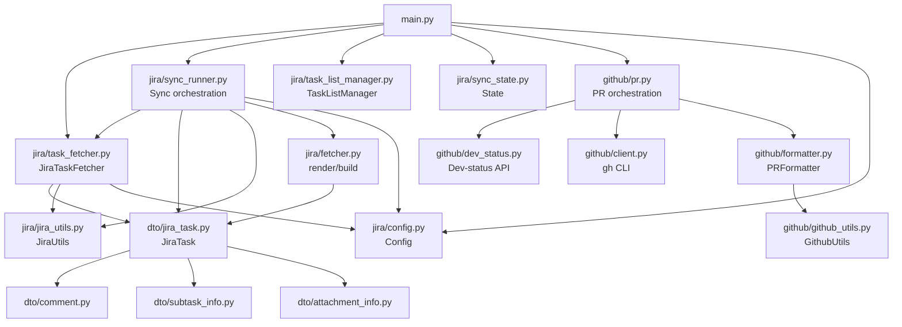

# jira-sync

Download Jira issues into a configured local task folder as LLM-friendly task files.

---

## 1. Project Structure

```
src/jira-sync/
├── main.py                     CLI entry point
├── jira/                       Jira modules
│   ├── task_fetcher.py         JiraTaskFetcher — API client
│   ├── fetcher.py              render_raw_md, build_task_json
│   ├── sync_runner.py          Sync orchestration (single + range)
│   ├── sync_state.py           Sync state persistence
│   ├── task_list_manager.py    TaskListManager — pending/not-sync lists
│   ├── config.py               Env loading, AppConfig, constants
│   └── jira_utils.py           JiraUtils — ADF extraction, formatting
├── github/                     GitHub modules
│   ├── github_utils.py         GithubUtils — formatting helpers
│   ├── formatter.py            PRFormatter — PR markdown rendering
│   ├── client.py               gh CLI wrapper
│   ├── dev_status.py           Jira dev-status API
│   └── pr.py                   PR orchestration (fetch + write pr.md)
├── dto/                        Shared dataclasses (one per file)
│   ├── jira_task.py            JiraTask
│   ├── app_config.py           AppConfig
│   ├── fetcher_config.py       FetcherConfig
│   ├── comment.py              Comment
│   ├── subtask_info.py         SubtaskInfo
│   ├── parent_info.py          ParentInfo
│   └── attachment_info.py      AttachmentInfo
├── templates/                  Output templates
│   ├── raw-template.md
│   └── pr-template.md
├── result/                     Runtime output files
└── test_app.py                 Unit tests
```



---

## 2. Configuration

Runtime settings in `src/jira-sync/config.json`, secrets in a `.env.local` file
whose path is controlled by the `env_path` config key (default: `../../.env.local`
relative to the config directory).

### config.json

```json
{
  "download_path": "../../.local/tasks",
  "sync_state_path": "result/sync-state.json",
  "not_found_state_path": "result/tasks-not-found.txt",
  "pending_tasks_path": "result/tasks-pending.txt",
  "template_paths": "templates/raw-template.md",
  "pr_template_path": "templates/pr-template.md",
  "env_path": "../../.env.local",
  "custom_fields": {
    "story_points": "customfield_12722",
    "sprint": "customfield_10006",
    "tags": "customfield_13351"
  }
}
```

Paths are resolved relative to the config file's directory (`src/jira-sync/`).

### .env.local

The location of this file is set by `env_path` in `config.json`.

```
JIRA_URL=https://your-org.atlassian.net
JIRA_EMAIL=you@example.com
JIRA_API_TOKEN=your-api-token
JIRA_PROJECT_KEY=YOURPROJECT
HTTP_TIMEOUT_SECONDS=30
```

### Discover custom fields

```bash
python main.py --discover       # show key fields + unmatched
python main.py --discover-all   # show all custom fields
```

Copy the output field IDs into `config.json` `custom_fields`.

---

## 3. Usage

Run from the `src/jira-sync/` directory.

### Single task

```bash
python main.py PROJ-2100
python main.py 2100              # uses JIRA_PROJECT_KEY
python main.py --force 2100      # overwrite existing
python main.py --relate 2100     # also download linked related tasks
```

### Range sync

```bash
python main.py                   # resume from last synced ID
python main.py --force           # force overwrite all
python main.py --start 100       # start from ID 100
```

### Pending tasks

```bash
python main.py --get-pending     # scan tasks for unresolved → tasks-pending.txt
python main.py --pending         # re-sync all pending, remove resolved ones
```

### GitHub PRs

```bash
python main.py PROJ-2190 --pr   # also fetch linked PRs into pr.md
```

---

## 4. Result files

All in `src/jira-sync/result/`, one task key per line (`PROJ-xxxx` format):

| File | Purpose |
|------|---------|
| `tasks-pending.txt` | Unresolved tasks for `--pending` re-sync |
| `tasks-not-found.txt` | Task IDs that don't exist — auto-skipped |
| `tasks-not-sync.txt` | Task IDs to never sync |
| `tasks-force-sync.txt` | Task IDs to always force-overwrite |

---

## 5. Output

### raw.md

- Status, type, priority, timetracking, assignee, reporter
- Labels, tags (hyperlinked to Jira search), fix versions
- Dates, resolution, URL
- Epic, sprint, parent, story points (all hyperlinked)
- Subtasks (sub-list, hyperlinked, sorted ASC by summary)
- Related tasks (hyperlinked)
- Attachments
- Description and comments (plain text in code blocks, HTML stripped)

### task.json

Structured JSON with all fields above plus:

- `estimated_seconds`, `spent_seconds`
- `description_text` (HTML stripped)
- `comments[].body_text` (HTML stripped)
- `related_tasks` array with relation types and sources
- `tags` array
- `paths.raw`, `paths.task_json`

### pr.md (with `--with-prs`)

- PR number, title, state, author
- Branch info, timestamps
- Stats (commits, additions, deletions, changed files)
- Labels, reviewers, commits
- Review comments and issue comments

---

## 6. Tests

```bash
cd src/jira-sync
python -m unittest test_app.py
```

---

## 7. Notes

- Only tasks from the configured `JIRA_PROJECT_KEY` are synced.
- Epic children are fetched via `parent=` JQL, only if `fields.subtasks` is empty.
- `story_points` field: use `Story point estimate` from `--discover`.
- `sprint` field: use `Sprint` from `--discover`.
- Single-task mode does not advance the range-sync resume state.
